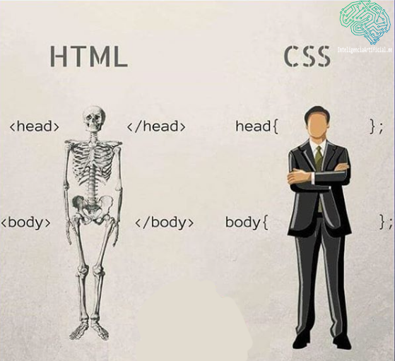
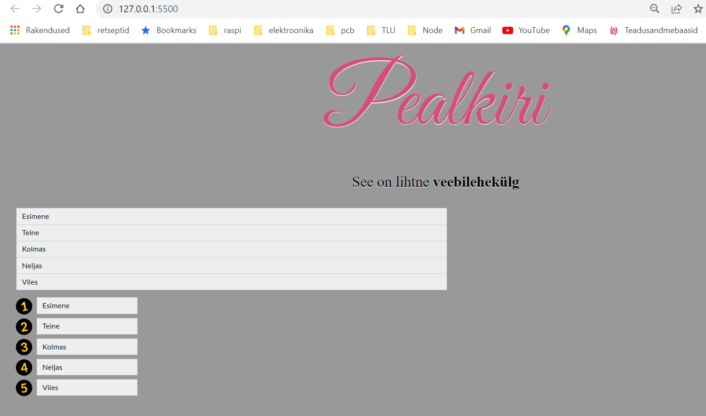

# CSS

**Cascading Style Sheets** (*CSS*) on laaditabeli keel, mida kasutatakse **HTML**- või **XML**-vormingus kirjutatud dokumendi esituse kirjeldamiseks. **CSS** kirjeldab, kuidas elemente tuleks ekraanil näidata.

**CSS** kuulub avatud veebi põhikeelte hulka ja on vastavalt W3C spetsifikatsioonidele standarditud kõigis veebilehitsejates.

Põhimõtteliselt on tegemist keelega, mis kirjeldab seda, kuidas veebileht välja peab nägema - kui **HTML** kirjeldab sisu, siis **CSS** kirjeldab välimust.

Allikas: https://developer.mozilla.org/en-US/docs/Web/CSS


## HTML ja CSS



Allikas: https://twitter.com/inteligenciabra/status/1248378033251074048

CSS abil veebilehe elementidele kujunduse kirjutamisel pannakse kirja kolm tähtsat osa: **selektor** (selector, mis on reeglina tavaline HTML-elemendi nimetus), **omadus** (property) ja selle **väärtus** ( value). Kõik see pannakse kirja järgmisel kujul:

```css
selector {property: value}
```

Näiteks:
```css
/* Kõik, mis on body elementide vahel, on musta värvi */
body {
  color: black
}

/* Lõigud kaldkirjas ja joondus keskel */
p {
  font-style: italic;
  text-align: center;
}
```

Kui võtta [HTML-i peatükis](../HTML/about.md) toodud html-kood ja seda CSS-koodiga täiendada, saab muuta lehekülje näiteks selliseks:

