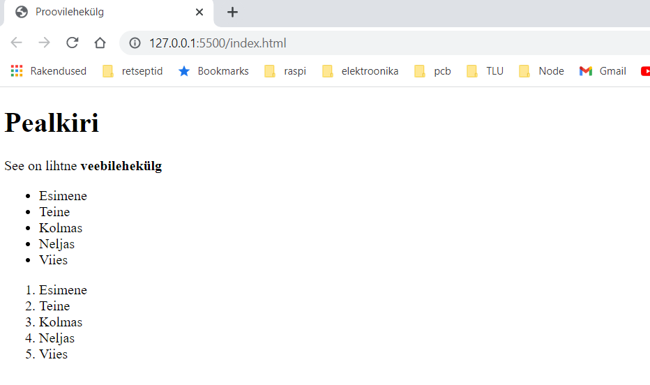

# HTML

HTML (HyperText Markup Language) on märgendikeel, mida kasutatakse veebilehe ja selle sisu struktureerimiseks. Näiteks võib sisu struktureerida lõikude komplekti, täpploendi või piltide ja andmetabelite abil.

HTML määrab veebilehe sisu struktuuri. HTML koosneb elementide seeriast, mida kasutate sisu erinevate osade kaasamiseks või mähkimiseks, et see teatud viisil välja näeks või teatud viisil toimiks. Kaasavad sildid võivad luua sõna või pildi hüperlingi kuhugi mujale, sõnad kursiivistada, fonti suurendada või vähendada jne.

Näiteks ühe lihtsa veebilehe HTML:

```html
<!DOCTYPE html>
<html lang="ee">
<head>
  <meta charset="UTF-8">
  <title>Proovilehekülg</title>
</head>
<body>
  <h1>Pealkiri</h1>
  <p>See on lihtne <strong>veebilehekülg</strong></p>
  <ul>
    <li>Esimene</li>
    <li>Teine</li>
    <li>Kolmas</li>
    <li>Neljas</li>
    <li>Viies</li>
  </ul>
  <ol>
    <li>Esimene</li>
    <li>Teine</li>
    <li>Kolmas</li>
    <li>Neljas</li>
    <li>Viies</li>
  </ol>
</body>
</html>
```

Selliselt kirjeldatud veebileht näeb veebilehitsejas välja selline:



Kui me vaatame veel korra selle veebilehe HTML-koodi, siis võib sealt eristada järgmisi HTML elemente:

- `<!DOCTYPE html>` - Dokumendi tüüp - kohustuslik osa veebilehest, kuigi tegemist on tänapäeval juba ajaloolise jäänukina.
- `<html></html>` - html element, mis mähib kogu lehe sisu ja seda nimetatakse ka juurelemendiks.
- `<head></head>` - see element toimib konteinerina kõige jaoks, mida HTML-lehele lisatakse ja mis ei ole sisu, mida lehe vaatajatele näidata. See hõlmab selliseid asju nagu märksõnad ja lehe kirjeldus, mida soovitakse otsingutulemustes kuvada, CSS-i sisu kujundamiseks ja palju muud.
- `<meta charset="utf-8">` - See element määrab "tähesitku", mida veebileht peaks kasutama. UTF-8 sisaldab enamikku kirjakeelte märke
- `<title></title>` - määrab lehe pealkirja, mis on pealkiri, mis kuvatakse veebilehitseja vahekaardil, kuhu leht laaditakse. Seda kasutatakse ka lehe kirjeldamiseks, kui lisate selle järjehoidjatesse/lemmikutesse.
- `<body></body>` - nende elementide vahele lisatakse kogu sisu, mida soovitakse veebikasutajatele näidata, kui nad lehte külastavad, olgu see siis tekst, pildid, videod, mängud, esitatavad heliribad või mis iganes muu.
- `<h1></h1>` - pealkiri (kõige suurem - neid on kokku kuus, mis on järjestatud vastavalt `<h1>`, `<h2>`, `<h3>` jne)
- `<p></p>` - paragrahv/tekstilõik
- `<strong></strong>` - rõhutatud tekst
- `<ul></ul>` - järjestamata nimekiri/list (nummerdatud)
- `<ol></ol>` - järjestatud nimekiri/list (nummerdatud)
- `<li></li>` - nimekirja kuuluv element

Allikas: https://developer.mozilla.org/en-US/docs/Learn/Getting_started_with_the_web/HTML_basics

Kokku on hetkel nimekirjas 142 HTML elementi.

Kogu HTML elementide nimekiri: https://developer.mozilla.org/en-US/docs/Web/HTML/Element