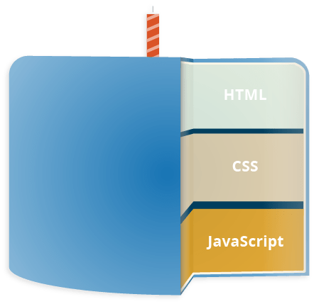

# Javascript

**JavaScript** on skriptimis- või programmeerimiskeel, mis võimaldab rakendada veebilehtedel keerulisi funktsioone – iga kord, kui veebileht teeb rohkemat kui lihtsalt istub ja kuvab teile vaatamiseks staatilist teavet – kuvab õigeaegseid sisuvärskendusi, interaktiivseid kaarte, animeeritud 2D/ 3D-graafika jne — võib kindel olla, et tõenäoliselt on tegemist JavaScriptiga. See on standardsete veebitehnoloogiate "kihikoogi kolmas" kiht HTML-i ja CSS-i kõrval.

Siin kontekstis räägime JavaScriptist, mis töötab veebilehitsejast ja millel puudub ligipääs arvutis olevatele failidele. Samas saab JavaScript koodi abil muuta kõike veebilehitsejas näidatava lehega seotut - nii seda mida seal näidatakse, kui ka seda, kuidas seda näidatakse.

Allikas: https://developer.mozilla.org/en-US/docs/Learn/JavaScript/First_steps/What_is_JavaScript