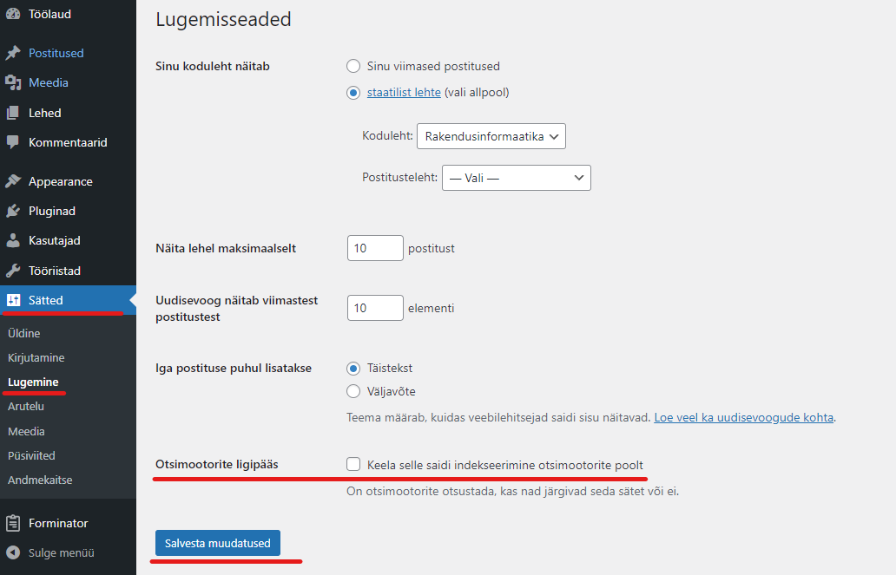
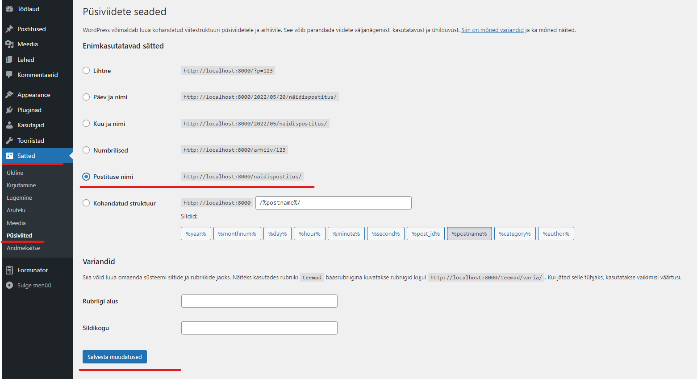
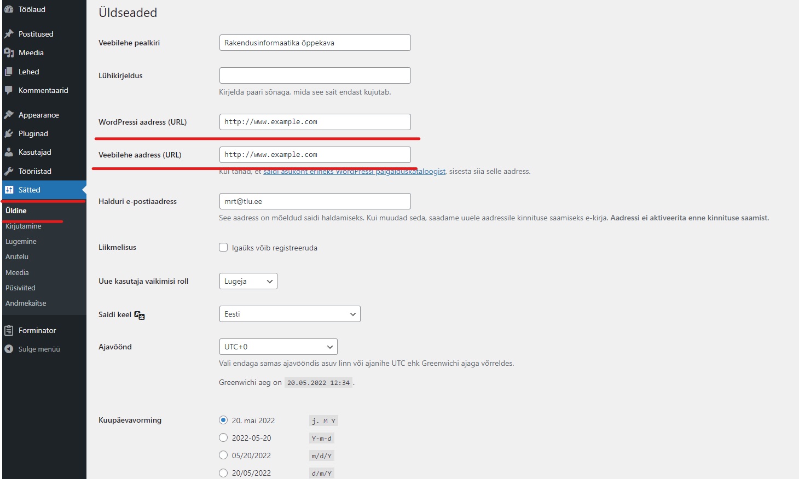

# SEO ehk veebilehe optimeerimine otsingumootori jaoks

## Mis on SEO?
SEO on akronüüm, mis tähistab otsingumootori optimeerimist (Search Engine Optimization). See on strateegia, mida veebisaitide omanikud kasutavad otsingumootoris kõrgema tulemuse saavutamiseks (mida parem tulemus, seda tihedamine otsingumootor kodulehekülge otsingutulemuste hulgas pakub).

Otsingumootori optimeerimine ei tähenda otsingumootorite petmist ega süsteemi manipuleerimist. See tähendab lihtsalt veebisaidi loomist, millel on optimeeritud kood ja vorming, mis muudab otsingumootoritel teie veebisaidi leidmise lihtsaks.

Kui inimesed otsivad veebist teemasid, millest kirjutate, ilmub teie otsingumootori jaoks optimeeritud veebilehe sisu otsingutulemustes kõrgemale ja teie veebisaidile klõpsab potentsiaalselt rohkem inimesi.

## Miks on SEO oluline?
Otsingumootorid on sageli veebisaitide suurim liikluse allikas.

Google ja teised otsingumootorid kasutavad lehtede mõistmiseks ja otsingutulemustes sobivaks järjestamiseks täiustatud algoritme. Need algoritmid pole aga täiuslikud – nad vajavad siiski abi, et mõista, millest veebilehe sisu räägib.

Kui veebilehe sisu pole optimeeritud, ei tea otsingumootorid, kuidas seda otsingutulemuste hulgas järjestada ja veebileht võib jääda otsingutulemuste hulgas väga lõppu.

Selleks, et otsingumootorid näitaksid veebilehte otsingutulemuste hulgas võimalikult kõrgel kohal, tuleb veebilehe sisu otsingumootrite jaoks sobivaks optimeerida.

## WordPressi SEO põhitõed
SEO võib muutuda üsna tehniliseks, kuid juba mõne põhilise SEO näpunäite järgmine võib teie veebisaidi liiklust märgatavalt suurendada. Järgnevalt mõned näpunäited, mille rakendamisega saab igaüks hakkama.

### WordPressi lehe nähtavus
WordPressil on sisseehitatud võimalus oma veebisaidi otsingumootorite eest peita. Selle valiku eesmärk on anda teile aega oma veebisaidi kallal töötamiseks enne, kui see on valmis avalikuks minema. Mõnikord võidakse seda valikut kogemata valida ja see muudab veebisaidi otsingumootoritele kättesaamatuks.

Selle valiku kontrollimiseks logi sisse oma WordPressi saidi administraatorialale ja külastage lehte **Sätted -> Lugemine**.

Keri lehe allaserva jaotiseni „**Otsingumootori ligipääs**” ja veendu, et ruut valiku „**Keela selle saidi indekseerimine otsimootorite poolt**” kõrval on märkimata.

Ära unusta muudatuste salvestamiseks klõpsata nuppu "**Salvesta muudatused**".

### SEO-sõbralike URL-ide kasutamine WordPressis
SEO-sõbralikud URL-id sisaldavad sõnu, mis selgitavad selgelt lehe sisu, ja neid on lihtne lugeda nii inimestele kui ka otsingumootoritele.

**Mõned näited SEO-sõbralikest URL-idest on järgmised:**

- https://example.com/how-to-install-wordpress/
- https://example.com/common-wordpress-errors-and-how-to-fix-them/

Pane tähele, et need URL-id on loetavad ja kasutaja võib lihtsalt URL-i teksti vaadates arvata, mida ta lehel näeb.

**Kuidas näeb välja mitte-SEO-sõbralik URL?**

- https://example.com/?p=10467
- http://example.com/archives/123

Pane tähele, et need URL-id kasutavad sisuga mitteseotud numbreid ja kasutaja ei saa URL-i vaadates arvata, mida ta lehelt leiab.

SEO-sõbraliku püsilingistruktuuri kasutamine suurendab võimalusi saada otsingutulemustes paremaid positsioone.

Mine WordPressi haldusliideses leheküljele **Sätted -> Püsilingid**. Vali postituse nime valik ja seejärel klõpsa seadete salvestamiseks nuppu "**Salvesta muudatused**".

> NB! Kui Sinu veebisait on töötanud üle 6 kuu, siis ära muuda püsilingi struktuuri, välja arvatud juhul, kui kasutad numbrite valikut. Kui kasutad valikut Päev ja nimi või Kuu ja nimi, jätka nende kasutamist.

Kui muudad püsilingi struktuuri kindlal saidil, kaotad kogu saidi sotsiaalmeedia jagamiste osakaalu ja võid kaotada koha olemasolevas SEO edetabelis.

### WWW vs mitte-WWW
Kui oled oma veebisaidiga alles alustamas, pead valima, kas soovid oma saidi URL-is kasutada www-d (**http://www.example.com**) või mitte-www-d (**http://example.com**).

Otsingumootorid käsitlevaid neid aadress kahe erineva veebisaidina, seega võiksid valida ühe ja sellest kinni pidada.

Saad määrata oma eelistuse, külastades lehte **Sätted -> Üldine**. Lisa oma eelistatud URL nii väljadele „**WordPressi aadress**” kui ka „**Saidi aadress**”.

SEO seisukohast ei ole ühe või teise kasutamisel mingit eelist.

Eelnev sisu (välja arvatud kuvatõmmised) on tõlgitud veebilehelt: https://www.wpbeginner.com/wordpress-seo/

## SEO pluginad
SEO-d aitavad parandada erinevad pluginad. Kõige populaarsemad neist on:
- [Yoast SEO](https://yoast.com/)