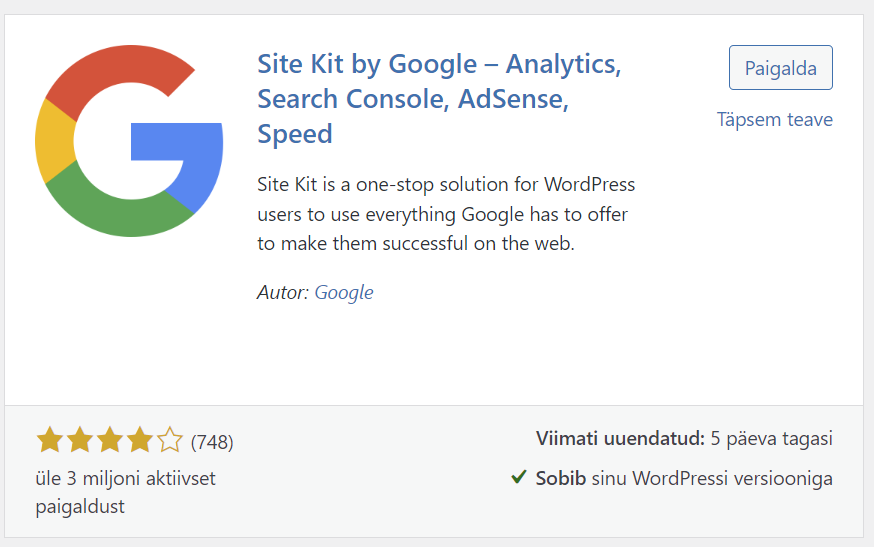
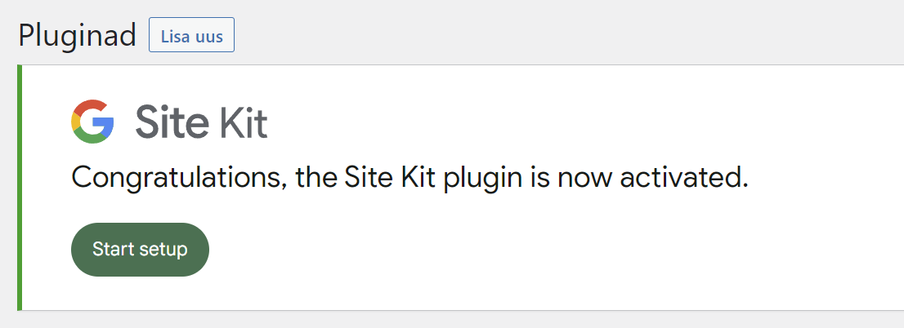

# Site Kit by Google – Analytics, Search Console, AdSense, Speed

Site Kit on Google'i ametlik WordPressi pistikprogramm, mis annab ülevaate sellest, kuidas inimesed teie saiti leiavad ja kasutavad. Site Kit on ühtne lahendus juurutamiseks, haldamiseks ja kriitiliste Google'i tööriistade ülevaate saamiseks, et sait veebis edukaks muuta. See pakub autoriteetset ja ajakohast ülevaadet mitmest Google'i tootest otse WordPressi juhtpaneelil, et hõlpsasti juurde pääseda, kõike seda tasuta

> NB! Site Kit-i ei saa paigaldada, kui kasutate lokaalset arenduskeskkonda.

