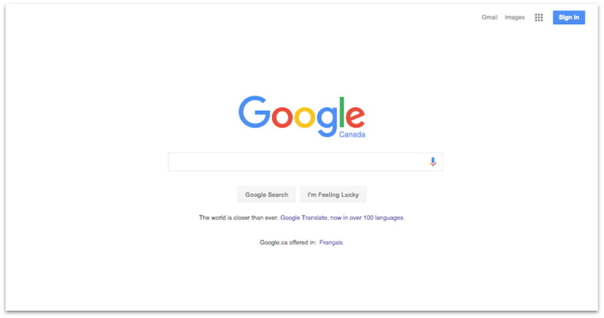
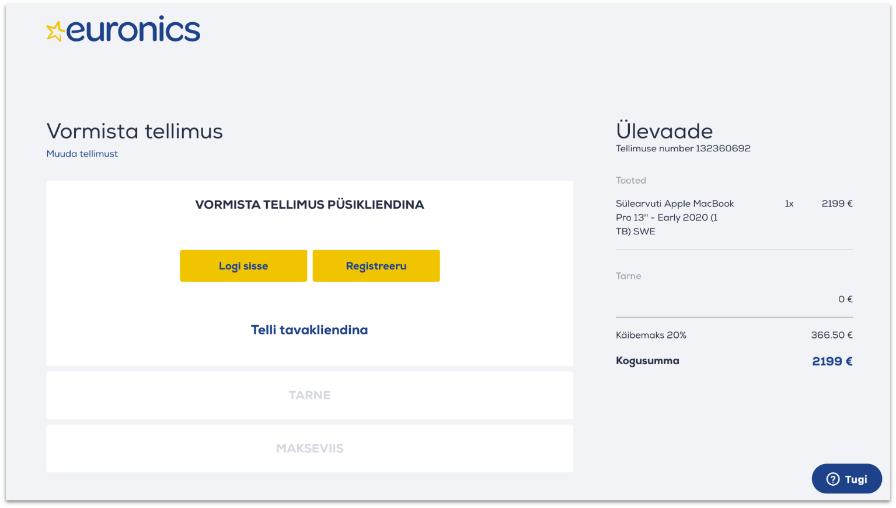
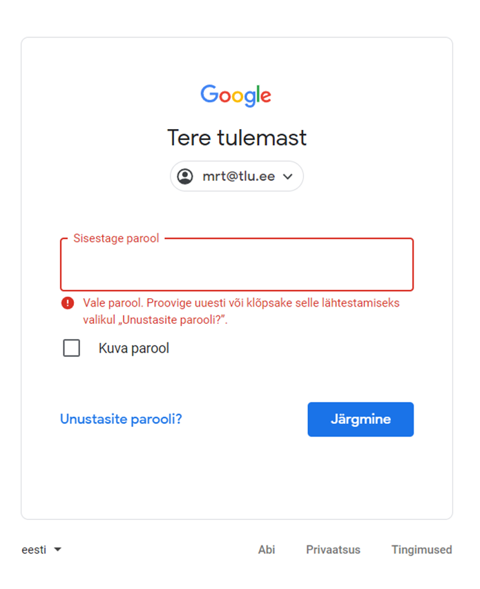
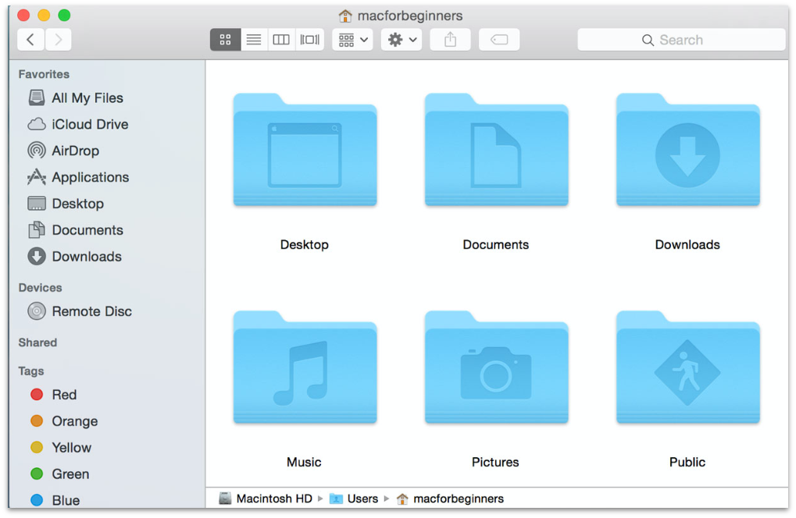
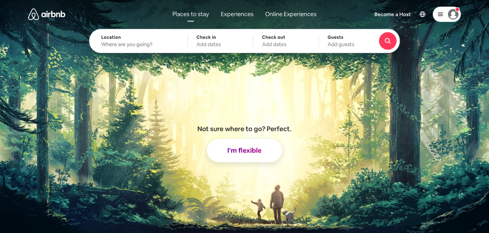
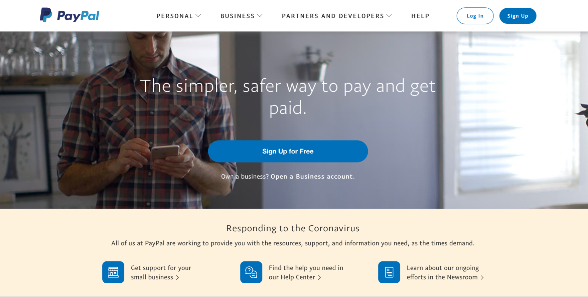
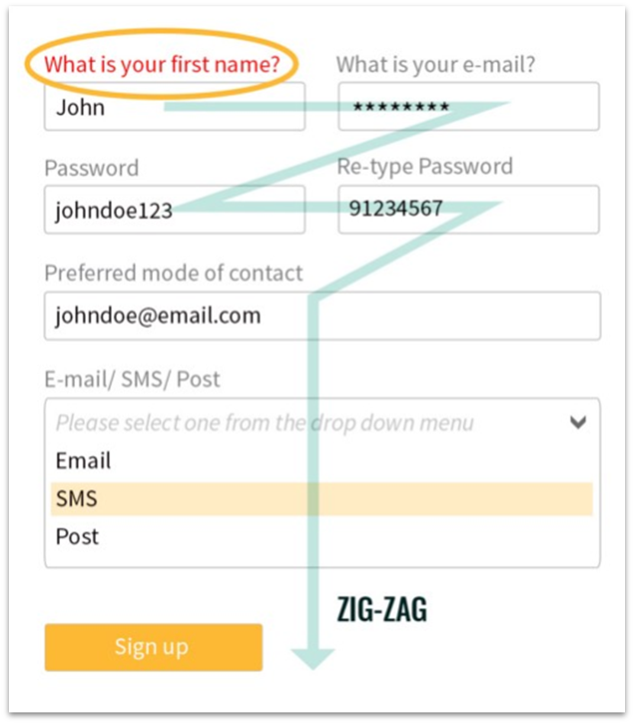
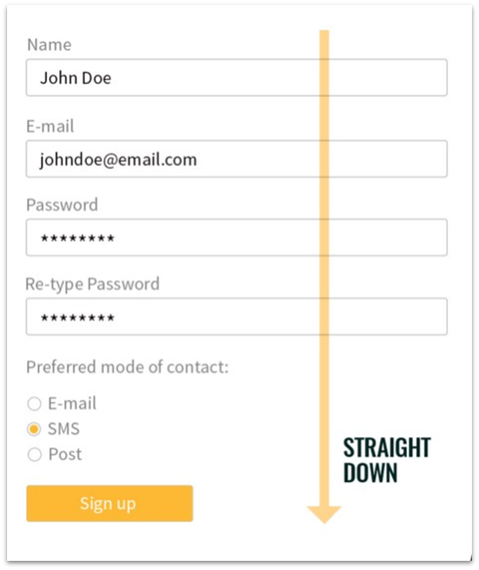

# Kasutajakogemuse disaini reeglid

Kasutajakogemuse reegleid on väga palju. Kõike neid ei jõua siin välja tuua ja ei ole ka mõtet. Järgnevalt on välja toodud mõned põhilised põhimõtted ja näited.

## Vaimse koormuse vähendamine
- Inimesed ei taha rohkem mõelda, kui hädapärast vajalik! Paku vaid kasutajatele **väärtuslikke või vajalikke funktsionaalsusi**!
- **Vähenda valikute ja võimaluste hulka** ning lase kasutajatel otsustada, kui palju infot / detaile nad hetkel vajavad;
- **Hicksi reegel**: otsustamisele kuluv **aeg kasvab koos valikute hulga ja keerukusega**! Tekib nn otsustus-väsimus.

yahoo.com vs google.com - Yahooga võrreldes on Google'i esilehe kasutamine hõlpsam.

## Tähelepanu hoidmine
- Inimeste tähelepanu hajub kergesti. Muuda **info hõlpsasti tarbitavaks** – liigenda tekstid lühikesteks plokkideks ja jaga **keerulised toimingud mitmeks osaks**. 
- **Milleri seadus**: inimesed suudavad korraga hoomata või meeles pidada 7 (+/–2) detaili;
- Kõige paremini jäävad meelde **seeria esimesed ja viimased elemendid**.

Euronics jagab ostu sooritamise mitmeks osaks, varjates tellimuse vormistamise ajal tarne ja makseviisi

## Eksimustega arvestamine
- Inimeste teevad vigu – muuda eksimuste korrigeerimine lihtsaks! Paku igas **toimingus alati tagasiteed**;
- Näe võimalikke eksimusi ette ning **jaga hoiatusi / selgitusi** toimuva kohta. Jälgi, et veebilehe poolt pakutavad võimalused oleks **üheselt mõistetavad**.
- **Posteli seadus**: ole liberaalne selles, mida aktsepteerid, ja konservatiivne selles, mida pakud.

Eksimustega arvestamine Gmaili sisselogimisel – mitut märkad?

## Järjepidevuse tagamine
- Kasuta sõnastusi ja mõisteid, mis on kasutajatele tuttavlikud. **Järgi üldkehtivaid reegleid ja tavasid;**
- Loo seoseid varasemate kogemustega – ära sunni kasutajaid õppima või mäletama, vaid võimalda neile äratundmist!
- Jakobi seadus: inimesed veedavad rohkem aega teistel veebilehtedel – **sinu leht peaks toimima sarnaselt teistele!**

Kausta ikoonid kasutavad visuaalset seost nn päris kaustadega – järjepidevus seniste kogemustega.

Kuna seostame punast värvi hoiatustega, toimib teine dialoogiaken paremini. Abiks on ka prügikasti ikoon! Näide:[UX Movement](https://uxmovement.com/)

## Esteetiliselt kujundamine
- Hoia disain minimalistlik ja esteetiline, et ebavajalik ei tõmbaks ülemäärast tähelepanu. Kõige lihtsam lahendus on alati kõige parem! 
- Kasuta värvi, suurust ja kontrasti, et suunata tähelepanu sellele, mis on oluline;
- **Von Restorffi efekt**: mitme sarnase objekti korral torkab silma see, mis teistest enim eristub.

Airbnb avalehel eristuvad täidetavad väljad tänu kontrastile. Olulisemad tegevused – otsimine ja sisse logimine – on markeeritud punasega ja tähistatud piltikoonidega. 

## Optimaalsuse tagamine
- Grupeeri tegevusi **loogiliselt ja sirgjooneliselt!** Väldi üleliigseid käe ja pilgu hüppeid;
- Otsingumootori eelistus (SEO): mida **vähem klikke** peab kasutaja veebilehel otsituni jõudmiseks tegema, seda kõrgem tulemus päringutes! 
- **Pareto printsiip**: 80% tagajärgedest on esile kutsutud 20% põhjuste poolt. Tuvasta, **millised 20% sinu veebilehe funktsioonidest kutsuvad esile 80% toimingutest** ja muuda need hästi kättesaadavateks!

PayPal tagab avalehel üheklikise ligipääsu kõigile olulisematele toimingutele. Lehe struktuur on lihtne, keerulised toimingud jagatud mitmeks osaks.

Esimene variant hakib kasutaja pilgu teekonda, teine aga suunab otse soovitud toimingu juurde. Näide: Dorjan Vulaj