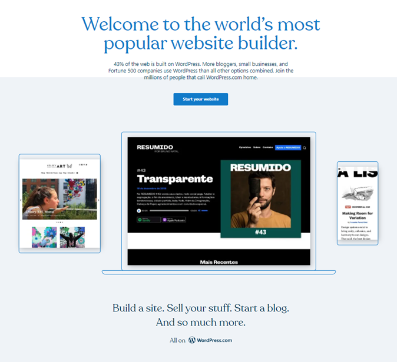
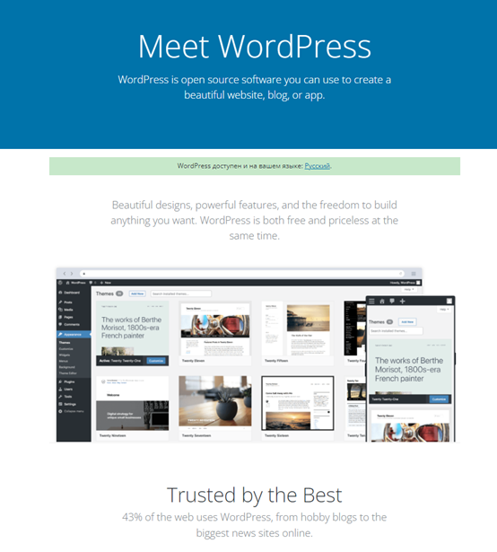

# Wordpress.org vs wordpress.com

Kui internetist otsida informatsiooni Wordpressi kohta, siis tihtipeale tekitab segadust, et välja tuleb kaks WordPressi nime kandvat lehekülge: **wordpress.org** ja **wordpress.com**.

Põhimõtteliselt on vahe selles, et **wordpress.org** lehekülg tegeleb WordPressi, kui tootega:
- [tugi](https://wordpress.org/documentation/)
- [õppematerjalid](https://learn.wordpress.org/)
- [dokumentatsioon](https://wordpress.org/documentation/)
- [wordpressi allalaadimine](https://wordpress.org/download/)

Wordpress.org otseselt rakenduse majutamisega ei tegele (pakub küll viiteid majutuse pakkujatele).

Wordpress.com lehekülg tegeleb otseselt WordPressi majutamise pakkumisega. Selle teenuse abil on võimalik väga lihtsalt ja kiiresti oma isiklik WordPressi lehekülg tööle saada.

Tasuta paketi puhul peab arvestama sellega, et loodud lehekülg sisaldab reklaame ja ei saa kasutada ka erinevaid pistikprogramme.

## Wordpress.com:

## Wordpress.org:
