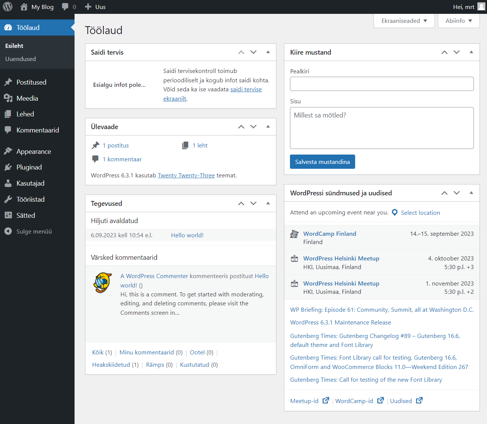
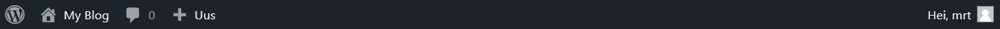
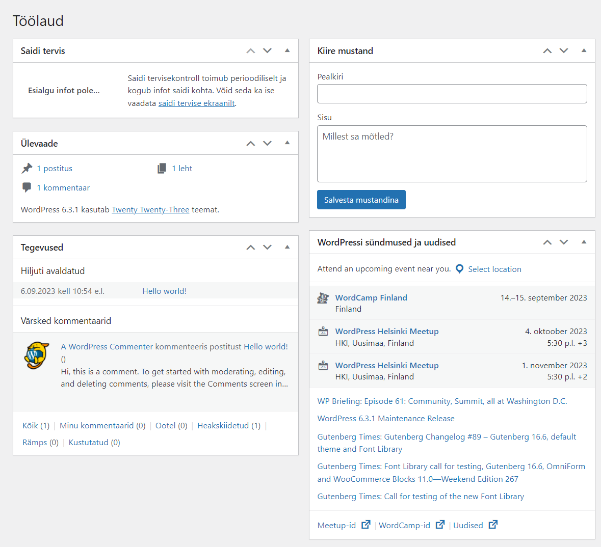
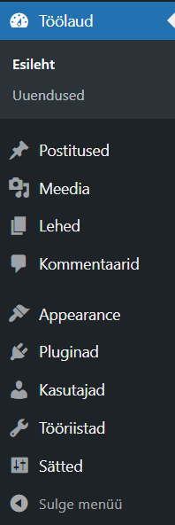
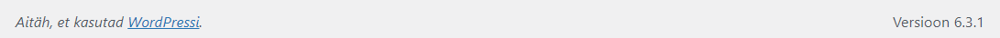

# Halduspaneel

Kui Wordpressi halduspaneeli sisse logida, siis on vaikimisi vaade järgmine:

Halduspaneeli saab suures plaanis jagada nelja ossa:
- [Tööriistariba](../toolbar/about.md)
- [Tööala](../dashboard/about.md)
- [Peamine navigatsiooni menüü](../navigation/about.md)
- Jalus

## Tööriistariba

Tööriistaribal on lingid erinevatele haldusfunktsioonidele ja see kuvatakse iga halduskuva ülaosas. Paljud tööriistariba elemendid laienevad, kui hiirega nende kohal *hõljuda*, et kuvada rohkem teavet.

## Tööala

Tööalal kuvatakse ja kogutakse konkreetset teavet, mis on seotud konkreetse navigeerimisvalikuga, näiteks uue postituse lisamisega.

## Peamine navigatsiooni menüü

Navigatsiooni põhimenüü kirjeldab üksikasjalikult kõiki haldusfunktsioone, mida saate täita. Selle jaotise allosas on nupp Ahenda menüü, mis kahandab menüü ikoonide komplektiks või laiendab, et loetleda need põhifunktsioonide järgi. Iga suurema funktsiooni (nt Postitused) sees laieneb alammenüü, kui kursoriga selle peal hõljuda, ja laieneb täielikult, kui üksusel klõpsatakse.

## Jalus

Jaluses iga administreerimisekraani allosas  on WordPressi lingid, mis tänavad teid selle kasutamise eest, ja lisaks kuvatakse installitud WordPressi versioon.