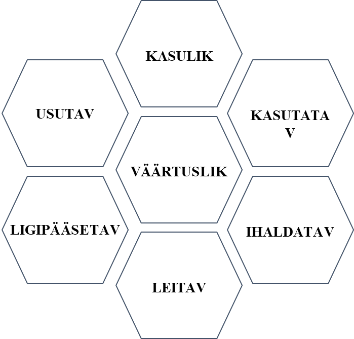

# Kasutajakogemuse disain

Kasutajakogemuse disain ehk UX disain (inglise keeles "User Experience Design") on protsess, mille käigus kujundatakse tooted ja teenused nii, et need vastaksid kasutajate vajadustele, eelistustele ja ootustele. UX disain keskendub sellele, kuidas kasutaja toodet või teenust kogeb, tagades, et interaktsioon oleks võimalikult sujuv, intuitiivne ja rahuldust pakkuv.

- Kliendi vajaduste ja ettevõtte äriliste eesmärkide ühildamine;
- **Ettevõtte jaoks**: Kasutajatele sisukaid, meeldivaid ja paindlikke kogemusi pakkuvate toodete loomise protsess;
- **Kliendi jaoks**: Emotsionaalse, intellektuaalse ja praktilise kogemuse pinnalt kujunev tervikmulje süsteemist (nt veebileht, rakendus) ja selle kasutamisest.

## Kasutajakogemuse disaini põhielemendid ja protsessid hõlmavad:

**Uuringud**: Kasutajate vajaduste ja ootuste mõistmine. Uuringud võivad hõlmata intervjuusid, vaatlusi, kasutatavusteste ja muud tüüpi uuringuid.

**Persona loomine**: Fiktiivsete kasutajaprofiilide loomine, mis esindavad sihtgrupi erinevaid segmente. Personad aitavad disaineritel ja arendajatel mõista kasutajate vajadusi, eelistusi ja käitumist.

**Veebilehe struktuuri ja infoarhitektuuri loomine**: Määratlemine, kuidas erinevad leheküljed või funktsioonid on omavahel seotud, ja kuidas kasutajad nende vahel navigeerivad.

**Prototüüpimine**: Interaktiivsete mudelite loomine, mida saab testida ja hinnata, enne kui arendusprotsess algab.

**Kasutatavuse testimin**e: Kasutajatega testimine prototüüpide või valmis toodetega, et tuvastada võimalikke probleeme ja parandada kasutajakogemust.

**Iteratsioon**: Pidev protsessi kordamine, kus kogutud tagasiside põhjal tehakse muudatusi ja täiendusi, et optimeerida kasutajakogemust.

**Kasutajaliidese (UI) Disain**: Kuidas leheküljed või rakenduse ekraanid välja näevad. See hõlmab kujunduse, värvide, fontide ja muude visuaalsete elementide valikut.

Kasutajakogemuse disaini eesmärk on luua lahendusi, mis on mitte ainult esteetiliselt meeldivad, vaid ka funktsionaalsed, kasutatavad ja mõistetavad. Hea UX disain aitab kaasa suuremale kasutajate rahulolule, vähendab vigade arvu ja suurendab kasutajate lojaalsust.

On oluline mõista, et kuigi UX ja UI disain on omavahel tihedalt seotud, ei ole need samad. UI (kasutajaliidese) disain keskendub toote visuaalsele aspektile ja sellele, kuidas kasutajad suhtlevad liidesega, samas kui UX disain käsitleb laiemat kasutajakogemust, hõlmates kõiki kasutaja ja toote vahelisi interaktsioone.

Joonise autor: Laura Hein

## Miks on kasutajakogemuse disain oluline?
- Veebilehe külastaja hinnang kujuneb vähem kui 10 sekundiga, esmane emotsioon vähem kui 1 sekundiga;
- Enamik lehelt lahkumisi leiab aset esimese 30 sekundi jooksul;
- Hea kasutatavus, struktuur ja disain pikendavad külastusi, suurendavad kasutajate aktiivsust ja kasumit; 
- Halvad kogemused jäävad eredamalt meelde kui head!

## Kasutajakogemuse kvaliteeti mõjutavad tahud

Joonise autor: Laura Hein

## Veebilehe tegemisel esita endale kolm küsimust:
- Mis see on, mida siin “müüakse”?
- Mis kasu kasutaja sellest teenusest/tootest saab?
- Mida peaks kasutaja järgmisena tegema?
