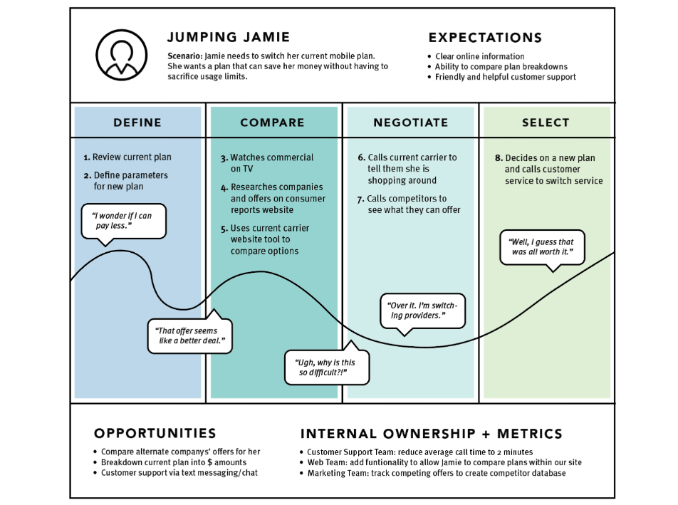

# Kasutaja teekond

## Mis on kasutaja teekond tarkvaraarenduses?

Kasutaja teekond, mida tuntakse ka kui kasutaja teekonnakaarti või kliendi teekonnakaarti, on tööriist, mida kasutatakse tarkvaraarenduses, et visualiseerida kasutaja kogemus toote või teenusega suheldes. See on sisuliselt kasutaja kogemuste samm-sammuline kaart, alates kasutaja esialgsest teadlikkusest tootest või teenusest, sellega suhtlemisest ja lõpuks otsuseni kasutamise jätkamisest või selle lõpetamisest.

Kasutaja teekond on tarkvara arendamiseks väärtuslik vahend, kuna see aitab tuvastada valupunkte ja piirkondi, kus kasutajakogemust saab parandada. Kasutaja kogemuste visualiseerimisega saavad tarkvaraarendajad ja disainerid paremini mõista, kuidas kasutaja suhtleb toote või teenusega. See omakorda aitab teha teadlikke otsuseid, kuidas kasutajakogemust optimeerida.

- Alternatiiv / laiendus stsenaariumile, loob tervikliku ülevaate kasutajakogemusest;
- Esmalt määratakse persoona ja stsenaarium, samuti eesmärgid. 
- Teisena on kaardistuse keskmes kogemuse visualiseering, mis jaotatakse mitmeks etapiks.
- Kolmanda osa moodustavad tähelepanekud ja võimalused edasiseks ning vastutajad.

Kasutajateekonna kaardistuse näidis (Nielsen Norman Group, 2021)

## Mida kasutaja teekond sisaldab?

Tüüpiline kasutaja teekond võib sisaldada mitmeid võtmeetappe, näiteks:
- **Teadlikkus**: kasutaja saab tootest või teenusest teada reklaami, sotsiaalmeedia või suusõnalise info kaudu.
- **Uuringud**: kasutaja viib läbi uuringuid toote või teenuse kohta lisateabe saamiseks, sealhulgas arvustusi lugedes, veebisaiti külastades või videot vaadates.
- **Registreerumine või ost**: kasutaja otsustab toote või teenuse.
- **Onboarding**: kasutajat juhendatakse toote või teenuse kasutusele võtmisel.
- **Kasutamine**: kasutaja kasutab toodet või teenust regulaarselt, puutudes kokku kasutjaakogemust paremaks muutvate omaduste ja funktsionaalsutega.
- **Tugi**: kasutajal võib tekkida toodete või teenusega probleeme või probleeme ning otsib arendaja või tugimeeskonna tuge.
- **Uuendamine või katkestamine**: kasutaja otsustab, kas jätkata toote või teenuse kasutamist, tellimuse uuendamist või kasutamise katkestamist.

Kaardistades kasutaja teekonna sel viisil, saavad tarkvaraarendajad ja disainerid tuvastada valdkonnad, kus saab parandada kasutajakogemust, näiteks lihtsustades *onboardingu* protsessi, täiustades toote funktsioone või pakkudes paremat tuge.

## Ülesanne
Võta aluseks loodud persoonad ja kirjuta igaühe kohta kas stsenaarium või kasutaja teekond, mis kirjeldaks sellele kasutajagrupile tüüpset kasutussituatsiooni!
Vajadusel võib kirjutada ühele persoonale mitu stsenaariumit / teekonda.

[Kasutaja teekonna loomise mall](./kasutaja_teekond.pdf)