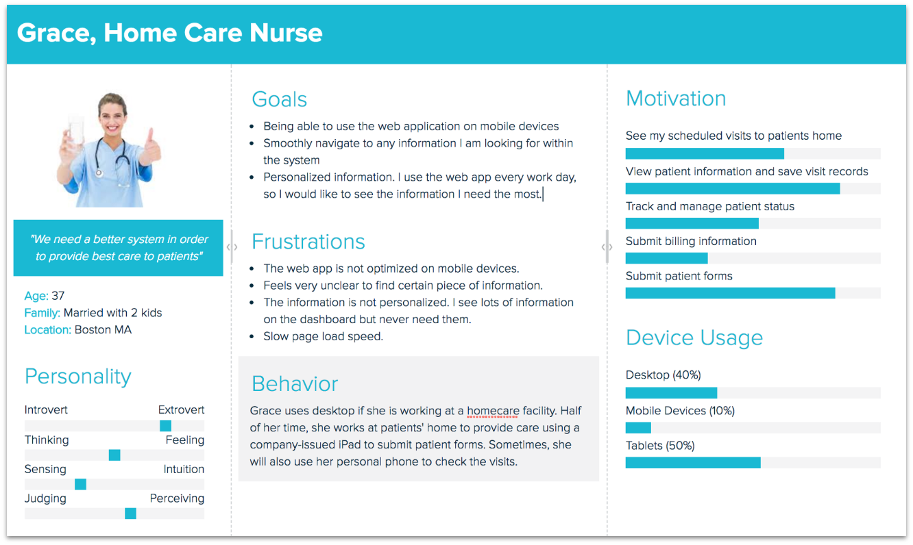
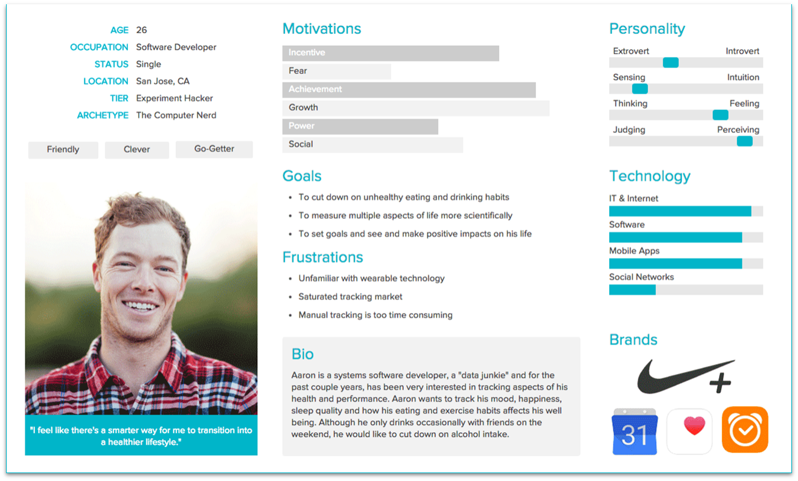

# Persoona

## Mis või kes on persoona?
Tarkvaraarenduse ja kasutajakogemuse kujundamise kontekstis on **persoona** väljamõeldud tegelane, kes esindab teatud tüüpi kasutajat. **Persoona** luuakse uurimistöö ja andmete põhjal reaalsete kasutajate kohta ning neid kasutatakse abistamaks disaineritel ja arendajatel oma kasutajate mõistmiseks ja nende vajadustest, eesmärkidest ja käitumisest aru saamiseks.

**Persoona** sisaldab tavaliselt teavet kasutaja demograafia (näiteks vanus, sugu ja amet), samuti üksikasjad nende huvide, motivatsiooni ja käitumise kohta. **Persoona** võib sisaldada ka teavet kasutaja eesmärkide, pettumuste ja valupunktide kohta, samuti üksikasju nende eelistatud suhtlemismeetodite kohta tarkvara või rakendusega.

**Persoonasid** kasutatakse empaatia tekitamiseks ning disainerite ja arendajate abistamiseks, mis põhinevad kasutaja vajadustel ja eelistustel. Mõistes eri tüüpi kasutajate vajadusi ja käitumist, saavad disainerid luua liideseid ja kogemusi, mis on kohandatud nende sihtrühmale, mille tulemuseks on tarkvara, mis on kaasahaaravam, kasutatavam ja tõhusam.

- Näidis-kasutaja, tüüpilise lõppkasutaja arhetüüp, kes esindab konkreetset kasutajagruppi;
- Luuakse kliendi paremaks mõistmiseks – mis teda motiveerib, mis ärritab, mida ta vajab?
- Ei asenda kasutajauuringuid, vaid tugineb nendel!
- Aitab disaini loomisel silmas pidada lõppkasutaja vajadusi, nt eristada olulisi funktsionaalsusi ebaolulistest.

Persoona loomiseks kogub meeskond tavaliselt teavet selliste uurimismeetodite abil nagu:
- küsitlused;
- intervjuud;
- reaalsete kasutajate vaatlus.
  
Seejärel kasutatakse seda teavet väljamõeldud isiku loomiseks, mis kehastab sihtrühma võtmeomadusi.

Isikute loomisel on oluline kaaluda tarkvara või rakenduse eesmärke, samuti sihtrühma omadusi. Näiteks kui tarkvara on mõeldud meditsiinitöötajatele, sisaldavad persoonad tõenäoliselt teavet nende töökohustuste, teadmiste taseme ja eelistatud meetodite kohta tarkvaraga suhtlemiseks. Teisest küljest, kui tarkvara on mõeldud nooremale publikule, võivad persoonad sisaldada teavet nende tehnoloogia kasutamise, huvide ja sotsiaalse käitumise kohta.

Kui persoonad on loodud, saab neid kogu kavandamise ja arendamise protsessi vältel kasutada disainiotsuste tegemiseks, kasutajate vajaduste hindamiseks ja tarkvara kasutatavuse testimiseks. Persoonasid kasutades saavad meeskonnad luua tarkvara, mis on tõhusam, kaasahaarav ja kasutajakeskne, põhjustades lõpuks nii kasutajatele kui ka arendajatele suuremat rahulolu ja edu.

## Mida persoonas kirjeldatakse?
- **Üldine info**
  - Nimi;
  - Vanus ja sugu;
  - Elukoht;
  - Haridus ja elukutse;
  - Perekondlik seis jne.
- **Pilt ja tsitaat**
  - Pilt räägib sõnadest rohkem – foto humaniseerib persoona. Proovi leida pilt, mis kirjeldaks sinu persoona isiksust;
  - Tsitaat annab persoonale hääle. Peaks kindlasti olema seotud sinu toote / teenusega
- **Iseloom, tüpaaž**
  - Persoona isiksuse kirjeldamine aitab teda paremini mõista;
  - Kirjelda tunnuseid, mis on sinu toote / teenuse seisukohast olulised (nt iseseisev vs tuge vajav;  järjepidev vs püsimatu jne)
- **Eesmärgid, sihid**
  - Ainult antud teenuse / tootega seotud motivatsioon!
  - Mida soovib saavutada? Mis on selle juures oluline? 
  - Mis võiks teenuse / toote juurde suunata? Mida soovib?
- **Valukohad, mure**
  - Ainult antud teenuse / tootega seotud probleemid! 
  - Mis takistab eesmärkideni jõudmisel? Millised on mured ja hirmud?
  - Kuidas takistusi ületab?

## Persoonade jaotumine

- **Proto-persoona**: ei tugine uutel uuringutel. Eesmärk on kiiresti luua visand või ülevaade olemasolevatest eeldustest! 
- **Kvalitatiivne persoona**: tugineb väikesemahulistel uuringutel (nt intervjuu, vaatlus). Eesmärk on klientide süvitsi mõistmine!
- **Kvantitatiivne persoona**: tugineb laiaulatuslikel uuringutel (nt statistika, küsitlused). Eesmärk on andmete isikustamine!

## Näiteid persoonadest

Autor: Shannon Cui

Autor: Julia Sjöberg

Autor: Xtensio

## Ülesanne
- Koosta etteantud [malli](./Persoona.pdf) järgi oma kodulehe potenstsiaalse kasutaja proto-persoona. Vajadusel võid neid teha ka mitu.
- Tutvusta oma koostatud persoonat paarilisele.