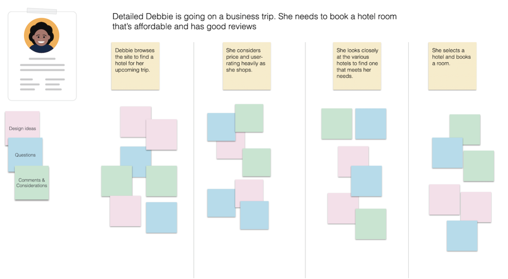

# Stsenaarium

## Mis on stsenaarium tarkvaraarenduse kontekstis

Tarkvara arendamisel viitab stsenaarium konkreetsele kasutusjuhtumile või olukorrale, millega kasutaja tarkvaraga suheldes võib kokku puutuda. Stsenaariume kasutatakse selleks, et kirjeldada, kuidas kasutaja tarkvaraga suhtleb ja milliseid samme nad peavad konkreetse ülesande või eesmärgi täitmiseks tegema.

Stsenaariumid luuakse tarkvara arendamisel sageli nõuete kogumise etapis ja neid kasutatakse tarkvara funktsionaalsete ja mittefunktsionaalsete nõuete määratlemiseks. Neid saab kasutada kasutajalugude jäädvustamiseks, kasutusjuhtumite koostamisel ja muud tüüpi nõuete dokumentatsioonis.

- Persoona-põhine kirjeldus toote/teenuse kasutamisest;
- Ei keskendu ärilistele või tehnoloogilistele nüanssidele ega disainile, vaid kirjeldab kasutajakogemust!
- Sisaldab:
  - tegija
  - motivatsioon
  - eesmärk või kavatsus
  - tegevus
  - tulemus või lahendus; 

Luuakse või valideeritakse koos persoona-sarnaste reaalsete kasutajatega (nn osalusdisain)!

Stsenaariumi töötoa näidis (Nielsen Norman Group, 2021)

## Mida stsenaarium sisaldab?

Tüüpiline stsenaarium võib sisaldada kasutaja kirjeldust, nende eesmärke või samme, mida nad peavad nende eesmärkide saavutamiseks võtma, ja kogu asjakohast teavet tarkvara või keskkonna kohta, kus seda kasutatakse. Näiteks võib e-kaubanduse veebisaidi stsenaarium kirjeldada kasutajat, kes soovib toodet osta, sealhulgas samme, mida nad vajavad toote leidmiseks, nende ostukorvi lisamiseks ja kassas protsessi lõpuleviimiseks.

Stsenaariumid on olulised, kuna need aitavad tagada, et tarkvara vastab kasutaja vajadustele ja seda saab tõhusalt kasutada reaalelulistes olukordades. Stsenaariumide loomisega saavad tarkvaraarendajad ja disainerid paremini mõista kasutaja eesmärke, eelistusi ja käitumist, mis võib aidata tarkvara kavandamist ja arendamist. Neid saab kasutada ka tarkvara kasutatavuse ja funktsionaalsuse testimiseks, aidates tuvastada ja käsitleda kõiki probleeme või probleeme enne tarkvara kasutajate väljaandmist.

## Näidis-stsenaarium

| Tegija | Tiina.. |
| --- | --- |
| Motivatsioon | ..soovib õppida, kuidas oma ettevõttele ise veebileht luua |
| Eesmärk | Ta tahab leida koolitust, mis sobiks hinnalt, oleks suunatud algajatele ja toimuks sobivatel kuupäevadel |
| Tegevus | Tiina valib koolituste nimekirjast talle sobiva kategooria, milleks on IT. Seejärel sorteerib ta koolitusi hinna ja toimumisaja alusel ning tutvub nende sisuga |
| Tulemus | Ta leiab nimistust sobiva koolituse ja registreerib osalejaks |

## Stsenaariumi koostamisel

- Väldi tehnoloogia või disaini liigset kirjeldamist – stsenaariumi eesmärk on olla disaini inspiratsiooniks, mitte fikseeringuks! 
- Ära kirjelda persoonat ja tema eesmärke ülemäärase detailsusega, keskendu vaid olulisele!

## Stsenaariumi loomise mall
[Stsenaariumi mall](./stsenaarium.pdf)