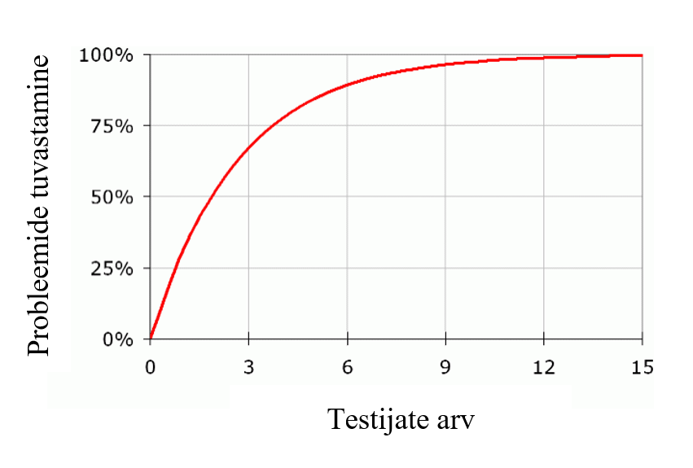

# Testimine

## Milleks testida?
- **Probleemide tuvastamine** disaini, toote või teenuse juures. 
- **Võimaluste leidmine** disaini parandamiseks. 
- **Kasutajate jälgimine** harjumuste ja eelistuste tuvastamiseks.

## Testimise elemendid:
- **Testi läbiviija** - juhendab testis osalejat ülesannete sooritamisel, vaatleb ja talletab reaktsioone, vajadusel esitab lisaküsimusi.
- **Ülesanded** ehk reaalsed tegevused, mida kasutajad sooritaks tavaolukorras. Edastatakse suuliselt või kirjalikult.
- **Osaleja / testija** - esindab testitava toote tavakasutajat, sooritab läbiviija poolt antud ülesandeid ja tegevusi, annab tagasisidet. 

## Ülesannete sõnastamine
- **Vältida** tuleb **mitmeti mõistetavaid** sõnastusi, kasutaja **eelhäälestamist, konkreetseid juhiseid** (nt “vajutage nupule Z vasakus servas”);
- Lähtuda tüüpilise kasutaja eesmärkidest (nn stsenaariumid);
- Sobiva sõnastuse näiteid:
  - “Kaalute X spordiklubiga liitumist. Külastage veebisaiti ja otsustage, milline pakett teile enim sobiks ning seejärel esitage elektrooniline avaldus paketiga liitumiseks.”
  - “Peate rääkima töötajaga Y projektijuhtimise osakonnast. Külastage ettevõtte veebilehte, et teada saada tema kontaktandmed. Öelge vastus testi läbiviijale

## Osalejate / testijate arv
- Piisab **kuni 5 testijast**, et tuvastada pea kõik kasutatavuse probleemid;
- Juba esimene testija tuvastab umbes ühe kolmandiku probleemidest; 
- Testimise võib lõpetada niipea, kui uus testija enam **midagi uut** välja ei too.

Testijate arvu ja tuvastatud probleemide vahekord. Näide: Nielsen Norman Group

## Suhtlus testimise ajal
- Testimine **ei ole intervjuu – ära katkesta** testijat; **ära paku abi** või suuniseid;** ära kommenteeri ega õpeta!**
- Enne sekkumist või vastamist hinda olukorda (nt loe peas kümneni)!
  - Kas testija reaktsioon (häälitsus, kommentaar) võimaldab teha järeldusi? 
  - Äkki oli testija küsimus retooriline ja ta ei ootagi vastust?
  - Kas lisaküsimuse abil oleks võimalik mingit uut infot omandada?
- Sekku või esita ise küsimusi siis, kui testija palub selgelt abi või tema tegevuses esineb loomulik paus. 

## Kaja meetod
- Läbiviija **kordab** testija sõnu või mõtteid **küsiva tonaalsusega**;
- Loob olukorra, kus testija peab täpsustama oma esialgset mõtet või reaktsiooni;
- Läbiviija ei mõjuta ega suuna testijat, sest jääb testija esialgse sõnastuse juurde

## Bumerangi meetod
- Läbiviija esitab **ohutu, neutraalse küsimuse** testija küsimuse või kommentaari tagasi tõrjumiseks;
- Nt “Mis sa arvad?” või “Mida sa tavaliselt teeks?”
- Loob tavalisele kasutusele sarnaneva olukorra, kus kasutaja peab ise lahendusi leidma. 

## "Columbo” meetod
- Läbiviija väljendab end meelega **ebamääraselt**, **jättes küsimused poolikuks** või umbkaudseks, kasutades **žeste** jne;
- oob olukorra, kus testija hakkab ise täpsustusi pakkuma või läbiviijat “aitama”;
- Läbiviija ei mõju ülemäära teadliku või eksperdina ega õpeta või suuna testijat. 

## Küsimuste esitamine
- **Ära anna hinnanguid** testija toimingutele, **ära suuna** vestlust kindale rajale!  
  - „Nägin, et teil on navigeerimisega raskusi. Mis juhtus?" (hindav, suunav) "Mis oli soovitud sisuni jõudmise juures lihtne või keeruline?" (neutraalne) 
- **Ära sõnasta** testijate juttu oma sõnadega ümber ega oleta, mida testija tunneb või arvab;
- **Ära anna vihjeid** soovitud vastuse osas:
  - “Kuidas aitaks see lahendus sul aega säästa?” (sisaldab vihjet) “Kas see aitaks kaasa töö efektiivsusele või mitte?” (võimaldab erinevaid vastuseid)
- **Ära nimeta konkreetseid elemente** (nt otsinguriba, märkeruut, “Salvesta” nupp vms).

## Testija tähelepanu suunamine
- **Ära nimeta konkreetseid elemente** (nt filter, otsinguriba, märkeruut, “Salvesta” nupp vms);
- Kasuta nn **Columbo meetodit!** Elementide nimetamise asemel nimeta toiminguid või viita žestide abil soovitud piirkonnale.

Allikas: https://www.nngroup.com/

