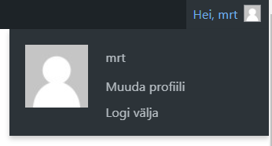

# Tööriistariba

Tööriistariba sisaldab linke teabele WordPressi kohta, samuti kiirlinke uute postituste, lehtede ja linkide loomiseks, uute pistikprogrammide ja kasutajate lisamiseks, kommentaaride ülevaatamiseks ja hoiatusi teie saidil olevate pistikprogrammide ja teemade värskenduste kohta.

> **Näpunäited**. Tööriistariba peitmiseks minge jaotisse Kasutajad > Profiil ja lülitage tööriistariba valikust välja „Näita esilehel tööriistariba”.

## Wordpressi logo

Tööriistariba kõige vasakpoolsemas servas on WordPressi logo. Viige või hõljutage kursorit logo kohal, et näha jaotisi
- WordPressi info
- WordPress.org
- Dokumentatsioon
- Tehniline toetus
- Tagasiside

## Lehekülje külastamise link

Tööriistaribal, WordPressi logost paremal, kuvatakse teie saidi nimi lingina. Hõljutage kursorit saidi nime kohal, et näha linki *Esilehele* saidi avalehe külastamiseks.

## Hei, kasutaja

Tööriistariba paremas servas on "Hei, kasutaja" koos teie Gravatari kujutisega. Kui hõljute kursorit, see laieneb, et näidata linke nii profiilikuvale kui ka väljalogimisele.

