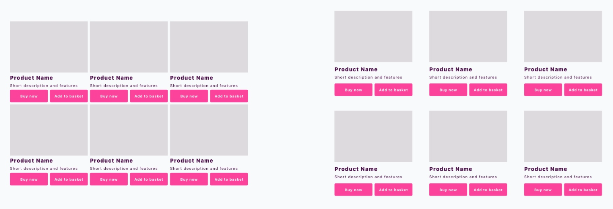

# Veebidisaini põhialused

## Hea disain on:
- **Praktiline**
  - Disain **suurendab funktsionaalsust**, aitab täita ettevõtte ja kasutajate eesmärke;
  - Disain on uuenduslik, ent **kauakestev** (ideaalis ajatu) ning piisavalt paindlik, et **võimaldada edasiarendusi**. Ökonoomsuse printsiip: Lihtsaim võimalik lahendus on alati parim!
- **Esteetiline**
  - Disaini **emotsionaalne sõnum on kooskõlas sisuga**! NB! Kasutaja alateadlik emotsionaalne reaktsioon on esimene ja domineerib teadvustatud info vastuvõtu üle! 
- Disaini meeldivus käivitab kasutajas **positiivse reaktsiooni**, muutes teda funktsionaalsete puudujääkide osas tolerantsemaks.
- **Fokusseeritud**
  - Disain on **arusaadav**, konkreetne ja süsteemne. **See tõmbab ja hoiab tähelepanu** sellel, mis on oluline;
- Kasutajat suunatakse sihipäraselt **eesmärkide saavutamise poole**. NB! Mida selgemini kasutaja tajub, et on eesmärgile lähedal, seda rohkem ta selle saavutamisesse panustab.

## Kompositsioon

### Pilgu trajektoor

- Pilk on pidevas liikumises, otsides pidepunkte. Kujunduse abil saab pilku hoida ja suunata;
- Ekraanidel jälgib pilk nn F-trajektoori, keskendudes rohkem üles ja vasakule äärele;
- Visuaalsed elemendid püüavad tähelepanu kindlas järjestuses.

### Kontrast

- Kõrgema eristuvuse ja selgusega elemendid saavad **rohkem tähelepanu** – kontrasti abil loome rõhuasetusi!
- Mõjutavad elemendi suurus, värv, heletumedus, detailsus, kuju, asetus;
- Inimsilm vajab **selget eristust esi- ja tagaplaani vahel**. Jälgi hoolega tausta ja detailide (nt teksti) vahelist kontrasti! 
- Nii liiga madal kui ka liiga kõrge kontrast põhjustavad vaimset ülekoormust!

Probleemid tekivad nii liiga kõrge kui liiga madala kontrasti puhul! Näited: HomeMuse ja Squarespace

Esimeses näites kahjustab madal kontrast rakenduse kasutatavust – ikoonid ja tekstid on halva loetavusega. Näide: CareerFoundry

- Kasutatavuse ja loetavuse seisukohast on eriti oluline teksti ja tausta vaheline kontrast!  
- See peab olema piisavalt kõrge, ent mitte ülemäära väsitav!

- Kontrast on oluline ka suuruses! Liiga väike erinevus elementide ja tekstide suuruses mõjub veana;
- Elemendid olgu kas selgelt võrdsed või selgelt erinevad!

### Korduvus

- Visuaalselt sarnaseid elemente peetakse omavahel seotuteks;
- **Jälgi, et omavahel sarnaneks vaid sarnase eesmärgi või funktsiooniga elemendid!** 
- Korduvate elementide kasutamine suurendab süsteemsust, terviklikkust ja stiilipuhtust!

Korduvus loob süsteemi. Näited: Career Foundry

Vasakpoolses näites tajume sarnasusest tulenevalt pigem nelja tulpa, paremas aga kolme rida! Näide: NNGroup

Õppevideo paremas tulbas ei eristu reklaamidest, kuna sellel on sarnane suurus ja kuju. Näide: Martha Stewart

## Joondus

- Kõik kujunduse elemendid on omavahel visuaalses seoses – miski **ei tohiks olla juhuslikult asetatud**;
- Korrektne joondumine annab kujundusele süsteemsuse, struktuuri. Märgatav on isegi 1px eksimus! 
- Tekstide puhul **eelista vasakjoondust!** 

Jälgi, kuidas tõmbavad tähelepanu joondust eiravad elemendid!

Jälgi, kuidas vasakjoonduse süsteemne kasutamine parandab veebilehe loetavust. Näide: Steven Bradley 

### Lähedus

- Lähestikku asuvad objektid mõjuvad rühmana, isegi kui need on visuaalsetelt tunnustelt ja kontrastilt erinevad;
- Paiguta lähestikku ainult sisuliselt seotud elemente! Jälgi, et erineva tähendusega elemendid ei asetseks teineteisele liiga lähedal.

Elementide liigne lähedus põhjustab probleeme kokkukuuluvuste tajumisel. Näide: UXMisfit 

### Vaba ruum

- Liidab ja eraldab,** tõstab olulist esile**, parandab **loetavust** ja **tähelepanu** püsivust;
- Mõjutab kasutaja **hoiakut**! Vähe ruumi – tähtsusetu, odav, ebakvaliteetne; Palju ruumi – oluline, väärtuslik, kvaliteetne.

Vaba ruumi abil saame juhtida tähelepanu olulisele. Võrdle vasak- ja parempoolset! Näide: Adobe

Vaba ruum mõjutab vaataja hinnangut teenuse või kauba väärtuse kohta. Näide: Classic Ink

Vaba ruumi kasvatamine nupu või üleskutse ümber suurendab selle kasutatavust. Näide: SitePoint

### Kiri
**Kirjatüübi olulisus**

- Kirja valik mõjutab veebilehe loetavust ja kasutatavust – mida loetavam kiri, seda funktsionaalsem veebileht!
- Loetavus sõltub kirjatüübi visuaalsetest omadustest;
- Kolm liiki: seriifkirjad, plokk-kirjad, ehiskirjad. 

Dishoomi veebileht kasutab seriifidega fonti, et mõjuda traditsioonilise ja klassikalisena. 

Taboo veebileht kasutab lihtsaid plokk-kirjastiile, mis loovad neutraalse, pigem kaasaegse mulje. 

Tomas Bata ülikool kasutab ehiskirja, et viidata tulevikutehnoloogiatele ja futurismile, ent selle loetavus on nõrk. 

**Tee kiri loetavaks**

### Värv
**Värvivalik**

- Värv loob **emotsioone** ja suurendab **kontrasti**, aidates kaasa veebilehe funktsionaalsusele;
- Värvitaju on **subjektiivne** ja kultuuriti erinev, arvestada tuleb ka erinevate värvide sümbolismiga!
- Hoia lehe** põhitonaalsus pigem neutraalsena**, et mitte väsitada kasutajate silmi. Lisa **värvi vaid tähelepanu-punktidesse!**

**Kokku sobivad:**

Soovituslik on alustada lehe loomist monokroomselt ja lisada värv alles siis, kui kõik suurused-asetused toimivad! Näide: Quartzy

Järgmise sammuna võiks sisse tuua ühe värvi koos heletumedustega – võimalik, et see katab kõik lehe vajadused! Kui ei, siis lisada veel üks värv.

### Kujutised ja graafika
**Kujutiste kasutus**

- **Kirjeldamise asemel näita** – visuaali vastuvõtt on kiirem ja emotsionaalsem!
- Eelista **konkreetseid, selgeid, kvaliteetseid kujutisi**. Ära kasuta kujutisi ja dekoori, mis ei haaku sisuga – need on vaid asjatud segajad; 
- Jälgi, et kujutised ja graafilised elemendid oleks **stiililiselt ühtsed**!
- Kasuta kujutisi ja graafikat **veebilehe struktureerimisel** ning tekstide **liigendamisel**, pakkudes kasutajatele vaheldusrikkust.

**Graafika aitab:**

Veebileht kasutab ikoone, et toetada pikema infoteksti sisu ja anda kiire ülevaade oma tegevusvaldkondadest.

Veebileht kasutab skeemi, et selgitada, kuidas nende teenus võiks klientidele kasulik olla.

Veebileht kasutab ikoone, et selgitada oma äritegevuste jaotumist ja geograafilist ulatust.
