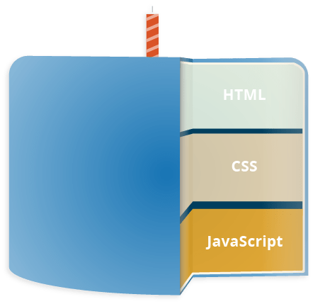

# Wordpressi algõpe

Martti Raavel
Haapsalu kolledž
2023

---
# Esimene kohtumine

- Kes me oleme ja milline on meie kokkupuude veebi ja veebilehtedega siiani?
- [Mis on internet?](../../concepts/Internet/about.md)
- [Mis on veebileht?](../../concepts/Veebileht/about.md)
- [Mis on Wordpress?](../../concepts/Wordpress/about.md)
- [Wordpressi kasutamise eelised ja miinused](../../concepts/plussidMiinused/about.md)
- [Wordpress.com vs Wordpress.org](../../concepts/WordpressVSWordpress/about.md)
- [Wordpressi majutamine](../../concepts/WordpressiMajutamine/about.md)
- [Wordpressi halduspaneeli kasutajaliides](../../concepts/halduspaneel/about.md)
- [Postitus ja lehekülg](../../concepts/postVSpage/about.md)

---
# Mis on internet?

Arvutivõrkude võrkude võrk
- Arvutivõrgud
- Serverid ja kliendid
- Domeeninimed ja IP aadressid, DNS
- Prorokollid
- ISP
- Ruuterid

---
# Mis on veebileht?

Veebileht on kogum faile, mis on üldjuhul kättesaadavad internetis ühe konkreetse domeeni (näiteks *www.tlu.ee*) all. Need failid võivad sisaldada **teksti**, **pilte**, **videoid**, **helifaile** ja muud meediat, samuti **koodi**, mis määrab, kuidas need elemendid kasutajale esitatakse. Veebilehti näidatakse kasutajale veebilehitseja abil, mis tõlgendab veebilehe koodi ja kuvab selle sisu kasutajaliideses.

---
# HTML

HTML (HyperText Markup Language) on märgendikeel, mida kasutatakse veebilehe ja selle sisu struktureerimiseks.

HTML määrab veebilehe sisu struktuuri.

---
# CSS

Põhimõtteliselt on tegemist keelega, mis kirjeldab seda, kuidas veebileht välja peab nägema - kui HTML kirjeldab sisu, siis CSS kirjeldab välimust.

---
# Javascript

---
# Mis on Wordpress?

Wordpress on avatud lähtekoodiga maailma kõige populaarsem sisuhaldussüsteem (CMS - Content Management System), mida kasutatakse veebilehtede loomiseks. WordPressi enda väitel on 43% veebilehtedest tehtud just WordPressi kasutades.

---
# Mis on sisuhaldussüsteem?

Sisuhaldussüsteem (Content Management System ehk CMS) on tarkvararakendus või -platvorm, mis võimaldab kasutajatel luua, hallata ja avaldada digitaalset sisu, tavaliselt veebisaitide ja blogide jaoks

---
# Wordpress.org vs Wordpress.com

- Wordpress.org tegeleb tarkvara arendamisega
- Wordpress.com pakub majutusteenust

---
# Wordpressi majutamine

Kui tahta teha omale Wordpressi abiga veebileht, siis ilmselt on vaja see ka internetis avalikult kättesaadavaks teha. Selleks on vaja leida endale sobiv majutusteenuse pakkuja.

Eestis pakuvad WordPressi majutamise võimalust näiteks:
- [Zone](https://www.zone.ee/)
- [Veebimajutus.ee](https://www.veebimajutus.ee/paketid-ja-hinnad)
- [Hostinger](https://www.hostinger.ee/parim-wordpress-veebimajutus)

---
# Mida täna kasutame?

Kui hetkel juba mõnda sobivat teenusepakkujat ei ole olemas ja tahaks lihtsalt katsetada ja harjutada, siis kasutame näiteks:

## https://byet.host/

---
# Byet kasutaja registreerimine

- Kasutaja registreerimine
- Kasutaja aktiveerimine
- Halduspaneel
- Wordpressi paigaldamine
- Wordpressile ligipääs

---
# Wordpressi halduspaneeli kasutajaliides

## ../wp-admin/

---
# Postitus vs Lehekülg

Vaikimis on Wordpressis kahte erinevat tüüpi sisu: **postitused** ja **leheküljed**.

Postitused on ajas muutuvad, leheküljed on aga staatilised. Postitusi kasutatakse näiteks blogi pidamiseks, lehekülgi aga näiteks kontaktinfo, teenuste ja toodete tutvustamiseks.

---
# Postitus (Post)

1. **Ajalisus**: Postitused on ajastatud ja kuvatakse tavaliselt kronoloogilises järjekorras, kusjuures uusimad postitused ilmuvad esilehel või postituste lehel kõige ees. 

2. **Kategooriad ja Sildid**: Postitusi saab liigitada kategooriate ja siltide järgi, mis aitavad organiseerida ja kategoriseerida blogi sisu.

3. **Kommentaarid**: Tavaliselt on postitustel võimalus lugejatel kommenteerida.

4. **Arhiiv**: WordPress loob automaatselt arhiivid postituste jaoks, mis põhinevad kuupäevadel, kategooriatel ja siltidel.

5. **Dünaamiline**: Postitusi kasutatakse sageli ajakohase sisu jaoks, näiteks blogipostitused, uudised, pressiteated jne.

---
# Lehekülg (Page)

1. **Staatiline sisu**: Leheküljed on mõeldud staatilise sisu jaoks, mis ei muutu sageli. Näiteid on "Kontakt", "Meist", "KKK" jne.

2. **Hierarhia**: Lehekülgedel on hierarhiline struktuur, mis tähendab, et saate luua alamlehti. Näiteks võib "Teenused" lehekülje all olla alamlehti nagu "Konsultatsioon", "Disain" jne.

3. **Ei kuulu kategooriatesse ega siltidesse**: Erinevalt postitustest ei liigitata lehekülgi kategooriate ega siltide alla.

4. **Kommentaarid**: Vaikimisi ei ole lehekülgedel kommentaaride osa, kuigi seda saab sõltuvalt teemast ja vajadusest lubada.

5. **Ei ole ajastatud**: Lehekülgedel puudub avaldamiskuupäev või aeg, ehkki need on loomulikult dateeritud sisemiselt.
---