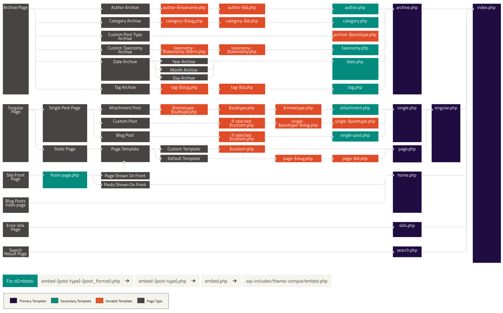
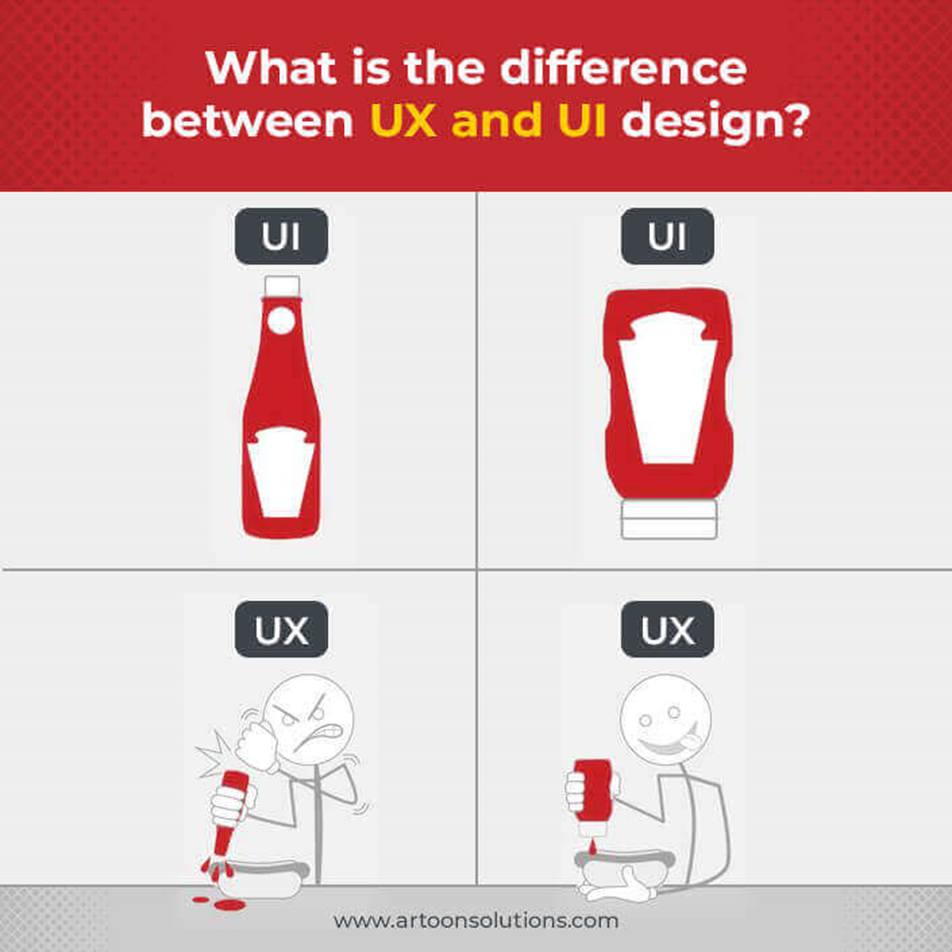
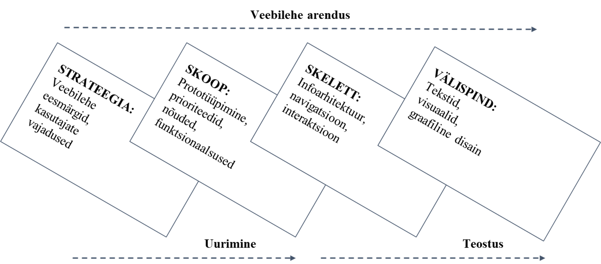
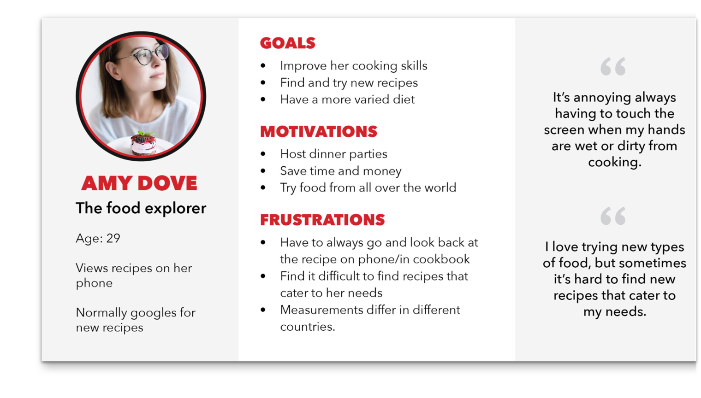
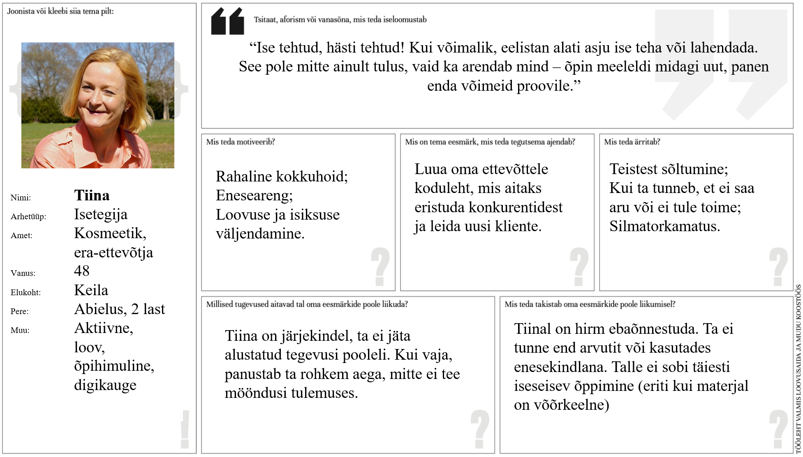

# Veebilehe loomise algõpetus Wordpressi platvormil

Martti Raavel
Haapsalu kolledž
2023

---
# Teine kohtumine

- Millest me eelmisel korral rääkisime?
- Miks ei näita featured image varianti postitustel?
- Kuidas Wordpress otsustab, millist malli kasutada?
- [Lähteülesanne](../../concepts/lähteülesanne/about.md)
- [Kasutajakogemus](../../concepts/kasutajakogemuseDisain/about.md)
- [Persoona](../../concepts/persoona/about.md)
- [Stsenaarium](../../concepts/stsenaarium/about.md)

---
# Eelmine kord

- [Mis on internet?](../../concepts/Internet/about.md)
- [Mis on veebileht?](../../concepts/Veebileht/about.md)
- [Mis on Wordpress?](../../concepts/Wordpress/about.md)
- [Wordpressi kasutamise eelised ja miinused](../../concepts/plussidMiinused/about.md)
- [Wordpress.com vs Wordpress.org](../../concepts/WordpressVSWordpress/about.md)
- [Wordpressi majutamine](../../concepts/WordpressiMajutamine/about.md)
- [Wordpressi halduspaneeli kasutajaliides](../../concepts/halduspaneel/about.md)
- [Postitus ja lehekülg](../../concepts/postVSpage/about.md)
- [Plokid ja plokimustrid](../../concepts/plokid/about.md)
- [Teema](../../concepts/teema/about.md)
- [Mall](../../concepts/mall/about.md)
- [Pluginad ehk pistikprogrammid](../../concepts/plugins/about.md)

---
# Wordpressi majutus?

Kas keegi on vahepeal endale registreerinud Wordpressi majutuse kusagil?

---
# Miks ei näita featured image varianti postitustel?

---
# Kuidas Wordpress otsustab, millist malli kasutada?

---
# Kuidas Wordpress otsustab, millist malli kasutada?

https://miro.com/app/board/uXjVOzhaWy4=/

---
# Lähteülesanne

Lähteülesanne veebilehe loomise kontekstis on dokument või juhend, mis sisaldab kogu vajalikku teavet ja nõudeid, et arendajad, disainerid ja muud osapooled saaksid mõista, mida veebiprojektilt oodatakse. See on aluseks veebilehe disaini ja arenduse protsessile ning aitab tagada, et kõik osapooled mõistavad projekti eesmärke, ulatust ja ootusi.

---
# Lähteülesanne

- Lühikirjeldus loodava veebilehe eesmärgist, nõuetest ja ajakavast;
- Annab osapooltele selge ühise arusaama projekti ootustest;
- Üldjuhul koostab lähteülesande veebilehe tellija;
- Põhjalik ja konkreetne briif tagab projekti õnnestumise.
---
# Mida lähteülesanne sisaldab?
- Ettevõtte kirjeldus
- Projekti skoop
- Projekti eesmärk
- Sihtrühma määratlus
- Tarbimismuster
- Peamised konkurendid
- Tehnilised nõuded
- Ajakava ja eelarve
- Kokkulepete fikseerimine
- Lansseerimine ja hooldus

---
# Ettevõtte kirjeldus
- Ülevaade ettevõttest
- Brändi väärtused, missioon ja visioon
- Ärilised eesmärgid ja arenguplaanid
- Peamised sidusrühmad.

---
# Projekti skoop
- Projekti ulatus ja tulemused
- Ootused visuaalidele ja tekstidele
- Peamised funktsionaalsused
- Kliendi kaasatus projekti
- Probleemide lahendamine
- Analüütika, mõõdikud

---
# Projekti eesmärk
- Probleem, mida lahendatakse
- Eesmärgid
  - bränditeadlikkuse või veebis kohaloleku kasv
  - müügi või külastuste suurendamine
  - peamiseks infoallikaks kujunemine
  - jne

---
# Sihtrühma määratlus
- Demograafia
- Psühhograafia
- Tarbimismuster
- Vajadused. 

---
# Peamised konkurendid
- Kes pakuvad samalaadset teenust / toodet / infot vms?
- Millised on nende veebilehed – peamiste tugevuste ja nõrkuste kaardistamine!
---
# Tehnilised nõuded
- Asjakohased nõuded ja spetsifikatsioonid!
- SEO-optimeerimine!
- Olulisemad funktsionaalsused
  - nt sisselogimine
  - kliendiandmete haldus
  - maksevõimalused jne
- Brändi stiilijuhised jt fikseeritud visuaalid
---
# Ajakava ja eelarve
- Orienteeruv tähtaeg!
- Jälgida, et oleks töömahu osas realistlik!
- Milline on eelarve?
- Rahalised vahendid võivad olla tehnoloogia valikul määravad.

---
# Kokkulepete fikseerimine
- Kontaktisikute ja vastutajate kinnitamine
- Kuidas ja kui tihti toimub suhtlus?
- Mis komponendid ja milline toode antakse projekti lõpuks üle?

---
# Lansseerimine ja hooldus
- Kes vastutab valminud lehe ülesseadmise eest?
- Domeeni ja majutuse hankimine
- Kuidas on tagatud edaspidi asetleidvad hooldustööd?

---
# Ülesanne 1
- Kasutades etteantud [malli](./Briif.pdf), koosta lähteülesanne oma planeeritavale veebilehele.
- Näita oma koostatud lähteülesannet paarilisele ja arutlege selle üle:
  - Kas kõik on arusaadav?
  - Kas on midagi puudu või ülearu?
  - Kas on paariliselt mingeid soovitusi või ideid, kuidas lähteülesannet paremaks teha?

---
# Ülesanne 2
- Leia vähemalt kolm samas või sarnases valdkonnas tegutseva ettevõtte veebilehte.
- Analüüsi nende ülesehitust ja disaini – Mis on nende tugevused? Mis nõrkused?

---
# Kasutajakogemuse disain

---
# Kasutajakogemuse disain
- Kliendi vajaduste ja ettevõtte äriliste eesmärkide ühildamine;
- **Ettevõtte jaoks:** Kasutajatele sisukaid, meeldivaid ja paindlikke kogemusi pakkuvate toodete loomise protsess;
- **Kliendi jaoks:** Emotsionaalse, intellektuaalse ja praktilise kogemuse pinnalt kujunev tervikmulje süsteemist (nt veebileht, rakendus) ja selle kasutamisest.

---
# Kasutajakogemuse disaini põhielemendid ja protsessid hõlmavad
- Kasutajauuringud
- Persoona loomine
- Veebilehe struktuuri ja infoarhitektuuri loomine
- Prototüüpimine
- Kasutatavuse testimine
- Iteratsioon
- Kasutajaliidese disain

---
# Kasutajakogemuse disain
Kasutajakogemuse disaini eesmärk on luua lahendusi, mis on mitte ainult esteetiliselt meeldivad, vaid ka funktsionaalsed, kasutatavad ja mõistetavad. Hea UX disain aitab kaasa suuremale kasutajate rahulolule, vähendab vigade arvu ja suurendab kasutajate lojaalsust.

---
# Miks on kasutajakogemuse disain oluline?
- Veebilehe külastaja hinnang kujuneb vähem kui 10 sekundiga, esmane emotsioon vähem kui 1 sekundiga;
- Enamik lehelt lahkumisi leiab aset esimese 30 sekundi jooksul;
- Hea kasutatavus, struktuur ja disain pikendavad külastusi, suurendavad kasutajate aktiivsust ja kasumit;
- Halvad kogemused jäävad eredamalt meelde kui head!

---
# Veebilehe arendus

---
# Veebilehe tegemisel esita endale kolm küsimust:
- Mis see on, mida siin “müüakse”?
- Mis kasu kasutaja sellest teenusest/tootest saab?
- Mida peaks kasutaja järgmisena tegema?

---
# Persoona
- Näidis-kasutaja, tüüpilise lõppkasutaja arhetüüp, kes esindab konkreetset kasutajagruppi;
- Luuakse kliendi paremaks mõistmiseks – mis teda motiveerib, mis ärritab, mida ta vajab?
- Ei asenda kasutajauuringuid, vaid tugineb nendel!
- Aitab disaini loomisel silmas pidada lõppkasutaja vajadusi, nt eristada olulisi funktsionaalsusi ebaolulistest.

---
# Mida persoonas kirjeldatakse?
- Üldine info
- Pilt ja tsitaat
- Iseloom, tüpaaž
- Eesmärgid, sihid
- Valukohad, mure

---
# Persoona - üldine info
- Nimi;
- Vanus ja sugu;
- Elukoht;
- Haridus ja elukutse;
- Perekondlik seis jne.

---
# Persoona - pilt ja tsitaat
- Pilt räägib sõnadest rohkem – foto humaniseerib persoona. Proovi leida pilt, mis kirjeldaks sinu persoona isiksust;
- Tsitaat annab persoonale hääle. Peaks kindlasti olema seotud sinu toote / teenuseg

---
# Persoona - iseloom, tüpaaž
- Persoona isiksuse kirjeldamine aitab teda paremini mõista;
- Kirjelda tunnuseid, mis on sinu toote / teenuse seisukohast olulised (nt iseseisev vs tuge vajav; järjepidev vs püsimatu jne)

---
# Persoona - eesmärgid, sihid
- Ainult antud teenuse / tootega seotud motivatsioon!
- Mida soovib saavutada? Mis on selle juures oluline?
- Mis võiks teenuse / toote juurde suunata? Mida soovib?

---
# Persoona - valukohad, mure
- Ainult antud teenuse / tootega seotud probleemid!
- Mis takistab eesmärkideni jõudmisel? Millised on mured ja hirmud?
- Kuidas takistusi ületab?

---
# Persoona - persoonade jaotumine
- Proto-persoonad
- Kvalitatiivne persoona
- Kvantitatiivne persoona

---

---
# Persoona - ülesanne
- Koosta etteantud malli järgi oma kodulehe potenstsiaalse kasutaja proto-persoona. 
- Tutvusta oma koostatud persoonat paarilisele.

---
# Stsenaarium
Tarkvara arendamisel viitab stsenaarium konkreetsele kasutusjuhtumile või olukorrale, millega kasutaja tarkvaraga suheldes võib kokku puutuda. Stsenaariume kasutatakse selleks, et kirjeldada, kuidas kasutaja tarkvaraga suhtleb ja milliseid samme nad peavad konkreetse ülesande või eesmärgi täitmiseks tegema.

---
# Stsenaarium
- Persoona-põhine kirjeldus toote/teenuse kasutamisest;
- Ei keskendu ärilistele või tehnoloogilistele nüanssidele ega disainile, vaid kirjeldab kasutajakogemust!
- Sisaldab:
  - tegija
  - motivatsioon
  - eesmärk või kavatsus
  - tegevus
  - tulemus või lahendus;

Luuakse või valideeritakse koos persoona-sarnaste reaalsete kasutajatega (nn osalusdisain)!

---

---
# Stsenaarium
| Tegija | Tiina.. |
| --- | --- |
| Motivatsioon | ..soovib õppida, kuidas oma ettevõttele ise veebileht luua |
| Eesmärk | Ta tahab leida koolitust, mis sobiks hinnalt, oleks suunatud algajatele ja toimuks sobivatel kuupäevadel |
| Tegevus | Tiina valib koolituste nimekirjast talle sobiva kategooria, milleks on IT. Seejärel sorteerib ta koolitusi hinna ja toimumisaja alusel ning tutvub nende sisuga |
| Tulemus | Ta leiab nimistust sobiva koolituse ja registreerib osalejaks |

---
# Stsenaariumi koostamisel

- Väldi tehnoloogia või disaini liigset kirjeldamist – stsenaariumi eesmärk on olla disaini inspiratsiooniks, mitte fikseeringuks! 
- Ära kirjelda persoonat ja tema eesmärke ülemäärase detailsusega, keskendu vaid olulisele!

---
# Kasutaja teekond

Kasutaja teekond, mida tuntakse ka kui kasutaja teekonnakaarti või kliendi teekonnakaarti, on tööriist, mida kasutatakse tarkvaraarenduses, et visualiseerida kasutaja kogemus toote või teenusega suheldes. See on sisuliselt kasutaja kogemuste samm-sammuline kaart, alates kasutaja esialgsest teadlikkusest tootest või teenusest, sellega suhtlemisest ja lõpuks otsuseni kasutamise jätkamisest või selle lõpetamisest.

---
# Kasutaja teekond

- Alternatiiv / laiendus stsenaariumile, loob tervikliku ülevaate kasutajakogemusest;
- Esmalt määratakse persoona ja stsenaarium, samuti eesmärgid.
- Teisena on kaardistuse keskmes kogemuse visualiseering, mis jaotatakse mitmeks etapiks.
- Kolmanda osa moodustavad tähelepanekud ja võimalused edasiseks ning vastutajad.

---
# Mida kasutaja teekond sisaldab?
- Teadlikkus
- Uuringud
- Registreerumine või ost
- Onboarding
- Kasutamine
- Tugi
- Uuendamine või katkestamine

Kaardistades kasutaja teekonna sel viisil, saavad tarkvaraarendajad ja disainerid tuvastada valdkonnad, kus saab parandada kasutajakogemust, näiteks lihtsustades *onboardingu* protsessi, täiustades toote funktsioone või pakkudes paremat tuge.

---

---
# Kasutaja teekond / stsenaarium - harjutus
- Võta aluseks loodud persoonad ja kirjuta igaühe kohta kas stsenaarium või kasutaja teekond, mis kirjeldaks sellele kasutajagrupile tüüpset kasutussituatsiooni!
- Vajadusel võib kirjutada ühele persoonale mitu stsenaariumit / teekonda.

---
