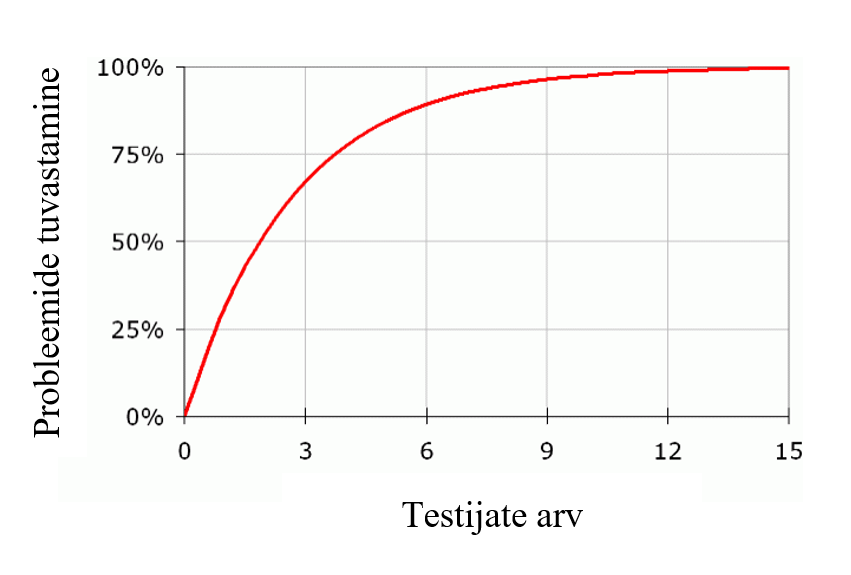

# Veebilehe loomise algõpetus Wordpressi platvormil

Martti Raavel
Haapsalu kolledž
2023

---
# Kolmas kohtumine
- [Kasutajalood](../../concepts/kasutajalood/about.md)
- [Kasutajakogemuse disaini reeglid](../../concepts/UXreeglid/about.md)
- [Veebididsaini põhialused](../../concepts/veebiDisainiAlused/about.md)
- [Abivahendid veebilehe loomisel](../../concepts/abivahendid/about.md)
- [Prototüüpimine](../../concepts/prototyypimine/about.md)
- Milliseid pistikprogramme on vaja
- [Testimine](../../concepts/testimine/about.md)

---
# Eelmine kord

- Millest me eelmisel korral rääkisime?
- Kuidas Wordpress otsustab, millist malli kasutada?
- [Lähteülesanne](../../concepts/lähteülesanne/about.md)
- [Kasutajakogemus](../../concepts/kasutajakogemuseDisain/about.md)
- [Persoona](../../concepts/persoona/about.md)
- [Stsenaarium](../../concepts/stsenaarium/about.md)
---
# Kasutajalood

Kasutajalugu on lihtne ühelauseline tarkvararakenduse funktsiooni või funktsionaalsuse kirjeldus, mis on kirjutatud lõppkasutaja vaatenurgast.

Kasutajalood on levinud tehnika, mida kasutatakse agiilses tarkvaraarenduses, et kirjeldada rakenduse nõudeid nii, et neid on lihtne mõista ja prioriteete seada.

---
# Kasutajalood
- Lihtsad, selged lühikirjeldused funktsionaalsustest, mis omavad väärtust lõppkasutajale
- Persoonade, kasutaja teekondade, intervjuude ja äriplaani pinnalt koostatav funktsionaalsuste loetelu;
- Vastab küsimustele: Kes vajab? Mida vajab? Miks? Kui oluline?

---
# Kasutajalugu

## *Registreeritud kasutajana tahan oma parooli lähtestada, et saaksin parooli unustamise korral oma kontole tagasi juurdepääsu.*

---
# Kasutajaloo kirjeldamisel

- **Tuvastage kasutaja**: alustage kasutaja või rolli tuvastamisest, kelle vaatenurgast lugu on kirjutatud. See võib olla konkreetne kasutaja või kasutajate rühm, kellel on sarnane vajadus.
- **Kirjeldage toimingut**: järgmisena kirjeldage toimingut, mida kasutaja soovib teha. See peaks olema lihtne ja selge kirjeldus selle kohta, mida kasutaja teha tahab.
- **Nimetage kasu**: lõpuks märkige kasu, mida kasutaja saab selle toimingu sooritamisest. See peaks kirjeldama, miks kasutaja soovib toimingu sooritada ja mida ta loodab saavutada.
---
# Näited - e-pood
1. **Külaliskasutajana** tahan, et saaksin **tooteid sirvida**, et **leida midagi**, mida osta.
2.  **Registreeritud kasutajana** soovin, et saaksin oma **ostukorvi tooteid lisada**, et **saaksin jälgida**, mida osta tahan.
3. **Registreeritud kasutajana** soovin, et mul oleks võimalik oma **kaupade eest tasuda**, et saaksin **ostu lõpule viia**.
4. **Registreeritud kasutajana** soovin **näha oma tellimuste ajalugu**, et saaksin **näha**, mida olen varem ostnud.
5. **Registreeritud kasutajana** soovin, et saaksin **kirjutada tootearvustusi**, et saaksin oma **kogemusi teiste kasutajatega jagada**.
6. **Registreeritud kasutajana** soovin, et saaksin **oma konto andmeid muuta**, et saaksin oma andmed **ajakohasena hoida**.

---
# Kasutajalood - harjutus
- Võta aluseks loodud stenaariumid ning persoonad ja loo nende pinnalt kasutajalood.
- Prioritiseeri kasutajalugude funktsionaalsused - nendest kasvab välja Sinu veebilehe hierarhia
- Näita oma loodud kasutajalugusid pinginaabrile ja arutlege nende üle - kas kõik tundub loogiline ja kas prioriteedid on paigas?
> NB! Kasutajalood tuleks ideaalis valideerida persoonade poolt esindatud kasutajagruppidega

---
# Kasutajakogemuse disaini reeglid
- Vaimse koormuse vähendamine
- Tähelepanu hoidmine
- Eksimustega arvestamine
- Järjepidevuse tagamine
- Esteetiliselt kujundamine
- Optimaalsuse tagamine

---
# Vaimse koormuse vähendamine

---
# Vaimse koormuse vähendamine

---
# Tähelepanu hoidmine
- Inimeste tähelepanu hajub kergesti. Muuda **info hõlpsasti tarbitavaks** – liigenda tekstid lühikesteks plokkideks ja jaga **keerulised toimingud mitmeks osaks**.
- **Milleri seadus:** inimesed suudavad korraga hoomata või meeles pidada 7 (+/–2) detaili;
- Kõige paremini jäävad meelde **seeria esimesed ja viimased elemendid.**

---
# Tähelepanu hoidmine

---
# Eksimustega arvestamine
- Inimeste teevad vigu – muuda eksimuste korrigeerimine lihtsaks! Paku igas **toimingus alati tagasiteed**;
- Näe võimalikke eksimusi ette ning **jaga hoiatusi / selgitusi** toimuva kohta. Jälgi, et veebilehe poolt pakutavad võimalused oleks **üheselt mõistetavad**.
- **Posteli seadus**: ole liberaalne selles, mida aktsepteerid, ja konservatiivne selles, mida pakud.

---
# Eksimustega arvestamine

---
# Järjepidevuse tagamine
- Kasuta sõnastusi ja mõisteid, mis on kasutajatele tuttavlikud. **Järgi üldkehtivaid reegleid ja tavasid**;
- Loo seoseid varasemate kogemustega – ära sunni kasutajaid õppima või mäletama, vaid võimalda neile äratundmist!
- Jakobi seadus: inimesed veedavad rohkem aega teistel veebilehtedel – **sinu leht peaks toimima sarnaselt teistele!**
---
# Järjepidevuse tagamine

---
# Järjepidevuse tagamine

---
# Esteetiliselt kujundamine
- Hoia disain minimalistlik ja esteetiline, et ebavajalik ei tõmbaks ülemäärast tähelepanu. Kõige lihtsam lahendus on alati kõige parem!
- Kasuta värvi, suurust ja kontrasti, et suunata tähelepanu sellele, mis on oluline;
- **Von Restorffi efekt**: mitme sarnase objekti korral torkab silma see, mis teistest enim eristub.

---
# Optimaalsuse tagamine
- Grupeeri tegevusi **loogiliselt ja sirgjooneliselt!** Väldi üleliigseid käe ja pilgu hüppeid;
- Otsingumootori eelistus (SEO): mida **vähem klikke** peab kasutaja veebilehel otsituni jõudmiseks tegema, seda kõrgem tulemus päringutes!
- **Pareto printsiip:** 80% tagajärgedest on esile kutsutud 20% põhjuste poolt. Tuvasta, **millised 20% sinu veebilehe funktsioonidest kutsuvad esile 80% toimingutest** ja muuda need hästi kättesaadavateks!

---
# Optimaalsuse tagamine

---
# Optimaalsuse tagamine

---
# Veebidisaini põhialused

---
# Pilgu trajektoor
- Pilk on pidevas liikumises, otsides pidepunkte. Kujunduse abil saab pilku hoida ja suunata;
- Ekraanidel jälgib pilk nn F-trajektoori, keskendudes rohkem üles ja vasakule äärele;
- Visuaalsed elemendid püüavad tähelepanu kindlas järjestuses.

---
# Pilgu trajektoor

---
# Pilgu trajektoor

---
# Kontrast
- Kõrgema eristuvuse ja selgusega elemendid saavad **rohkem tähelepanu** – kontrasti abil loome rõhuasetusi!
- Mõjutavad elemendi suurus, värv, heletumedus, detailsus, kuju, asetus;
- Inimsilm vajab **selget eristust esi- ja tagaplaani vahel**. Jälgi hoolega tausta ja detailide (nt teksti) vahelist kontrasti!
- Nii liiga madal kui ka liiga kõrge kontrast põhjustavad vaimset ülekoormust!
- Kontrast on oluline ka suuruses! Liiga väike erinevus elementide ja tekstide suuruses mõjub veana;
- Elemendid olgu kas selgelt võrdsed või selgelt erinevad!
---
# Korduvus
- Visuaalselt sarnaseid elemente peetakse omavahel seotuteks;
- Jälgi, et omavahel sarnaneks vaid sarnase eesmärgi või funktsiooniga elemendid!
- Korduvate elementide kasutamine suurendab süsteemsust, terviklikkust ja stiilipuhtust!

# Joondus
- Kõik kujunduse elemendid on omavahel visuaalses seoses – miski ei tohiks olla juhuslikult asetatud;
- Korrektne joondumine annab kujundusele süsteemsuse, struktuuri. Märgatav on isegi 1px eksimus!
- Tekstide puhul eelista vasakjoondust!

---
# Lähedus
- Lähestikku asuvad objektid mõjuvad rühmana, isegi kui need on visuaalsetelt tunnustelt ja kontrastilt erinevad;
- Paiguta lähestikku ainult sisuliselt seotud elemente! Jälgi, et erineva tähendusega elemendid ei asetseks teineteisele liiga lähedal.

---
# Vaba ruum
- Liidab ja eraldab, **tõstab olulist esile**, parandab loetavust ja tähelepanu püsivust;
- Mõjutab kasutaja **hoiakut**! Vähe ruumi – tähtsusetu, odav, ebakvaliteetne; Palju ruumi – oluline, väärtuslik, kvaliteetne.
---
# Vaba ruum

---
# Kirjatüübi olulisus

- Kirja valik mõjutab veebilehe loetavust ja kasutatavust – mida loetavam kiri, seda funktsionaalsem veebileht!
- Loetavus sõltub kirjatüübi visuaalsetest omadustest;
- Kolm liiki: seriifkirjad, plokk-kirjad, ehiskirjad.

---

---
# Kirjatüübid
- **Seriifkirjad** on kirjad, millel on väikesed lisad (nn jalad) tähtede otstes. Parandavad pigem paberile trükitud teksti loetavust;
- **Plokk-kirjad** - ilma seriifideta, tähekujud on geomeetrilised ja lihtsad. Ekraanil hea loetavusega.
- **Dekoratiivsed ehiskirjad** on teistest tunduvalt kehvema loetavusega - pigem kasuta neid minimaalselt.

---
# Värv
- Värv loob **emotsioone** ja suurendab **kontrasti**, aidates kaasa veebilehe funktsionaalsusele;
- Värvitaju on **subjektiivne** ja kultuuriti erinev, arvestada tuleb ka erinevate värvide sümbolismiga!
- Hoia lehe **põhitonaalsus pigem neutraalsena**, et mitte väsitada kasutajate silmi. Lisa värvi vaid tähelepanu-punktidesse!

---

---
# Kokku sobivad

---
Soovituslik on alustada lehe loomist monokroomselt ja lisada värv alles siis, kui kõik suurused-asetused toimivad! Näide: Quartzy

---
# Kujutiste kasutus

- **Kirjeldamise asemel näita** – visuaali vastuvõtt on kiirem ja emotsionaalsem!
- Eelista **konkreetseid, selgeid, kvaliteetseid** kujutisi. Ära kasuta kujutisi ja dekoori, mis ei haaku sisuga – need on vaid asjatud segajad;
- Jälgi, et kujutised ja graafilised elemendid oleks **stiililiselt ühtsed**!
- Kasuta kujutisi ja graafikat **veebilehe struktureerimisel** ning tekstide **liigendamisel**, pakkudes kasutajatele vaheldusrikkust.

---

---

---
# Prototüüpimine

Prototüüpimine on tehnika, mida kasutatakse tarkvaraarenduses tarkvaratoote või -süsteemi varajaste töötavate versioonide loomiseks. Prototüüpimine hõlmab lõpptootest lihtsustatud, kuid funktsionaalse versiooni loomist, mida saab kasutada tagasiside kogumiseks, ideede testimiseks ja nõuete täpsustamiseks enne lõpliku versiooni loomist.

---
# Prototüüpimine
Mõned prototüüpide loomise eelised tarkvaraarenduses on järgmised:
- Parem suhtlus ja koostöö meeskonnaliikmete ja sidusrühmade vahel
- Võimalike probleemide ja parendusvaldkondade varajane tuvastamine
- Arusaamatuste ja valesti suhtlemise oht arendajate ja sidusrühmade vahel
- Disainikontseptsioonide ja töövoogude kiirem iteratsioon ja testimine
- Parem kasutajate seotus ja rahulolu varajase tagasiside ja sisendi kaudu

---
# Paberprototüüpimine
Paberprototüüpimine on odav ja madala täpsusega prototüüpimise tehnika, mida kasutatakse tarkvaraarenduses toote või süsteemi kiire, lihtsa ja interaktiivse esituse loomiseks.

---
# Paberprototüüpimine
- Madalad kulud
- Lihtne kasutada
- Kiire iteratsioon
- Parandatud suhtlus
- Varajane kasutajate kaasamine

---
# Digitaalsed prototüüpimise tööriistad
- Figma
- Adobe XD
- Sketch
- InVision
- Axure
- ...

---
# Ülesanne

- Loo oma veebilehe paberprototüüp
- Pööra tähelepanu eelnevalt loodud kasutajalugudele ja nende prioriteetidele
- Kasuta paberprototüübi loomiseks paberit ja pliiatsit

---
# Testimine
- **Probleemide tuvastamine** disaini, toote või teenuse juures.
- **Võimaluste leidmine** disaini parandamiseks.
- **Kasutajate jälgimine** harjumuste ja eelistuste tuvastamiseks.

---
# Testimise elemendid
- **Testi läbiviija** - juhendab testis osalejat ülesannete sooritamisel, vaatleb ja talletab reaktsioone, vajadusel esitab lisaküsimusi.
- **Ülesanded ehk reaalsed tegevused**, mida kasutajad sooritaks tavaolukorras. Edastatakse suuliselt või kirjalikult.
- **Osaleja / testija** - esindab testitava toote tavakasutajat, sooritab läbiviija poolt antud ülesandeid ja tegevusi, annab tagasisidet.

---
# Ülesannete sõnastamine
- Vältida tuleb mitmeti mõistetavaid sõnastusi, kasutaja eelhäälestamist, konkreetseid juhiseid (nt “vajutage nupule Z vasakus servas”);
- Lähtuda tüüpilise kasutaja eesmärkidest (nn stsenaariumid);

---
# Ülesannete sõnastamine
**Sobiva sõnastuse näiteid:**
- “Kaalute X spordiklubiga liitumist. Külastage veebisaiti ja otsustage, milline pakett teile enim sobiks ning seejärel esitage elektrooniline avaldus paketiga liitumiseks.”
- “Peate rääkima töötajaga Y projektijuhtimise osakonnast. Külastage ettevõtte veebilehte, et teada saada tema kontaktandmed. Öelge vastus testi läbiviijale

---
# Osalejate / testijate arv
- Piisab **kuni 5 testijast**, et tuvastada pea kõik kasutatavuse probleemid;
- Juba esimene testija tuvastab umbes ühe kolmandiku probleemidest;
- Testimise võib lõpetada niipea, kui uus testija enam **midagi uut** välja ei too.

---

---
# Testimine - ülesanne

- Koosta kirjalikult testimiseks ülesanded, lähtudes kõige tõenäolisematest kasutusjuhtudest.
- Leia enda veebilehe jaoks 2-3 testijat ja vii nendega ükshaaval testimine läbi. Testimise ajal tee märkmeid, vaatle testija reaktsioone (nt häälitsusi, sõnastusi, näoilmet, žeste, kehakeelt jne), vajadusel toeta suuliselt testijat ning esita küsimusi

